# Administrator User Manual

**Version 2.0** · 27 September 2026 · for Portal v11 (adds Calendar, Discussions, Library, Attendance, Documents, Reports)

## Welcome

Administrators run the Center's side of the portal: approving fee payments (which opens courses to students), managing courses, lecturers and students, posting announcements, keeping the organisation details up to date, and looking after Ezra and the system's health. Lecturers handle teaching and marking; administrators don't publish results.

### First-day checklist

- [ ] Change the default admin password (**My profile → Change password**).
- [ ] Set your real login email on **Administrators → Edit** (replace `admin@example.com`).
- [ ] Add a second administrator, so someone else can help if you are locked out.
- [ ] Fill in **Settings**: organisation name, contact details, address and **payment details** (students see these when paying).
- [ ] Create the courses and assign a lecturer to each.
- [ ] Post a welcome announcement.
- [ ] Set up Ezra's API key and check its spending limit (section 4).

The dashboard's **setup checklist** reminds you of anything left undone.

## 1. Getting around

### The dashboard

After logging in you see the admin dashboard: payments waiting, fees collected per month, enrolments by course, the newest students, recent activity, system health, and the setup checklist.

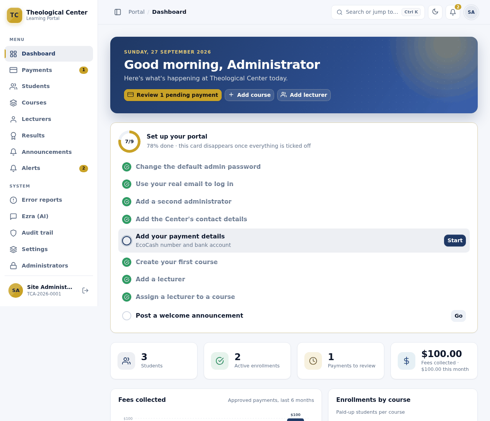

### The menu

| Menu item | What it's for |
| --- | --- |
| Payments | Approve or reject proofs of payment; history and receipts |
| Students | Find students, reset passwords, deactivate, export to Excel |
| Courses | Create courses and assign lecturers |
| Lecturers | Create lecturer accounts |
| Results | Overview of published results, export to Excel |
| Attendance | Attendance rate per course, export to Excel |
| Documents | Verify ID copies and qualifications; required documents; who is missing one |
| Reports | Pass rates by province, grades, students, attendance, fees, documents (charts, print, CSV) |
| Announcements | Messages on everyone's dashboard |
| Alerts | Your own notifications |
| Calendar, Discussions, Library | The Campus pages (section 7) |
| Error reports | Problems the portal caught or users reported |
| Ezra (AI) | The AI assistant's spending and settings |
| Audit trail | Who did what, and when |
| Settings | Organisation details, payment details, grade boundaries |
| Administrators | Add and manage admin accounts |

Numbers next to menu items show things waiting for you (for example payments to review, or password reset requests on **Students**).

### Quick search

1. Press **Ctrl + K** (or click **Search or jump to...** at the top).
2. Type what you want to do, for example `reset password`, `add a course` or `export`.
3. Press **Enter** or click the result.

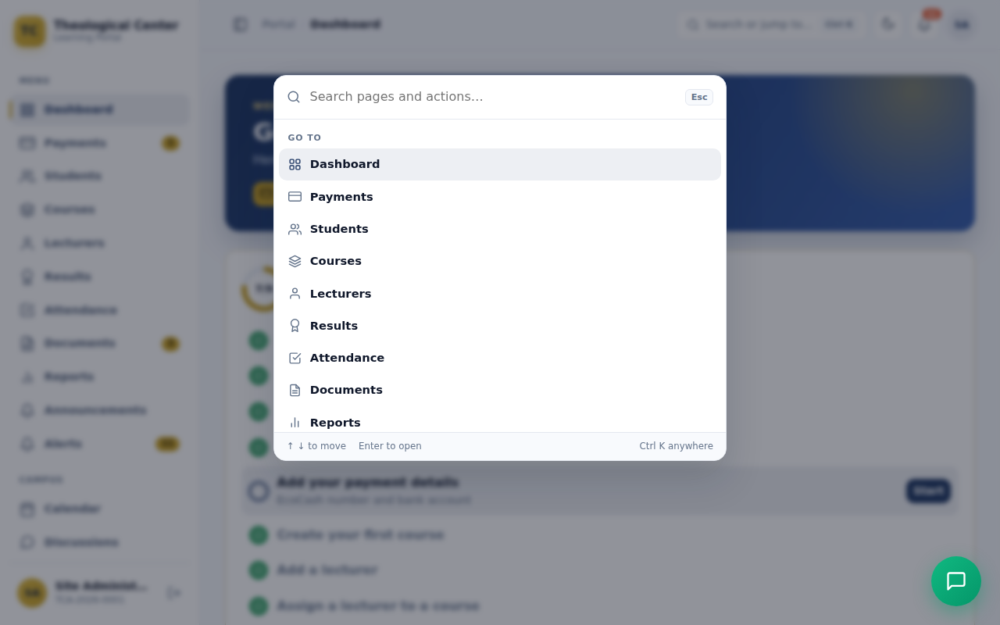

On a phone, the bottom bar has Dashboard, Payments, Students and Alerts; **More** opens the same search with every page.

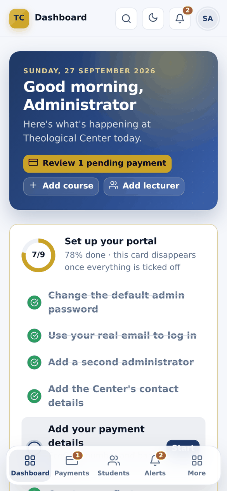

## 2. Payments, courses and people

### Approve or reject a payment

Approving a payment is the moment a student's course opens, so check each proof against your EcoCash or bank statement first.

1. Click **Payments** (the number shows how many are waiting).
2. Each card shows the proof image, the student, the course, the amount and the method. Click **Proof** to open it full size.
3. If the money has arrived, click **Approve** and confirm. The student is alerted and the course opens straight away.
4. If not, click **Reject**, type the **Reason (the student will see this)**, for example "Amount is $40, the fee is $50", and click **Reject payment**. The student can upload again.

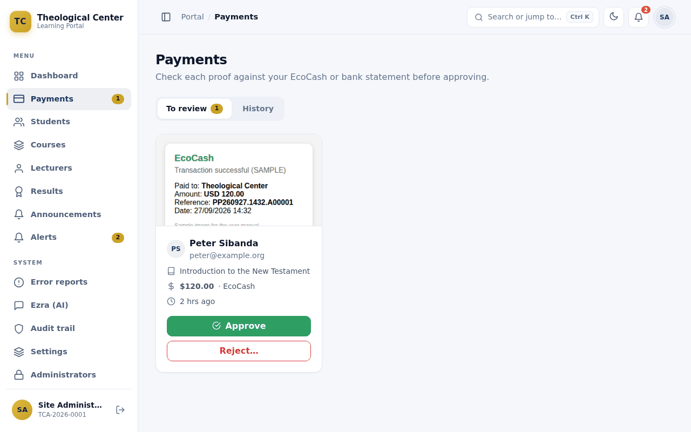

To find an older payment or print a receipt, click **History**, then **Receipt** on the payment.

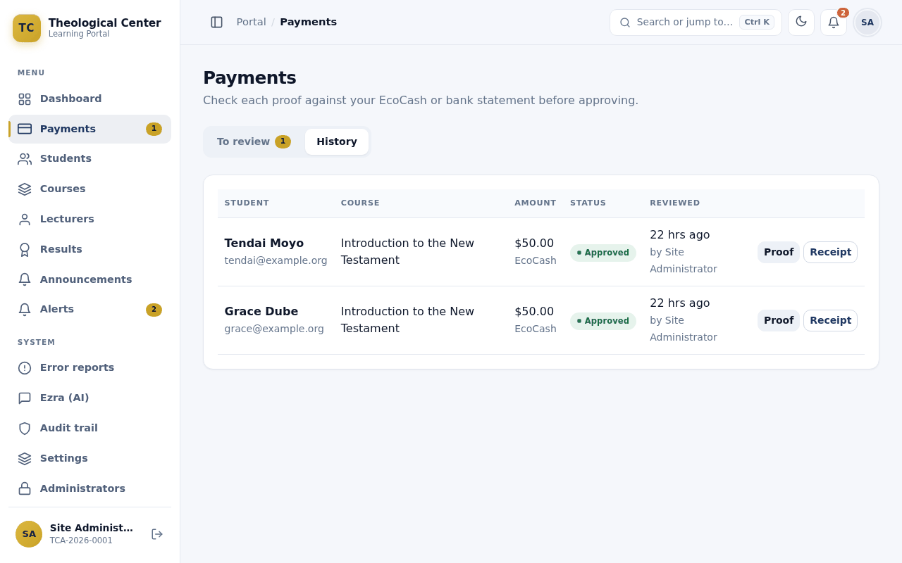

### Create a course and assign a lecturer

1. Click **Courses**.
2. Under **Add a Course**, type the course name, a short description, the fee in dollars and the length (for example "1 Year").
3. Click **Add Course**. Students can now see it and apply.
4. Under **Assign a Lecturer to a Course**, choose the course and the lecturer, then click **Assign**. A course can have several lecturers.
5. To remove a lecturer from a course, click the remove button next to their name and confirm.

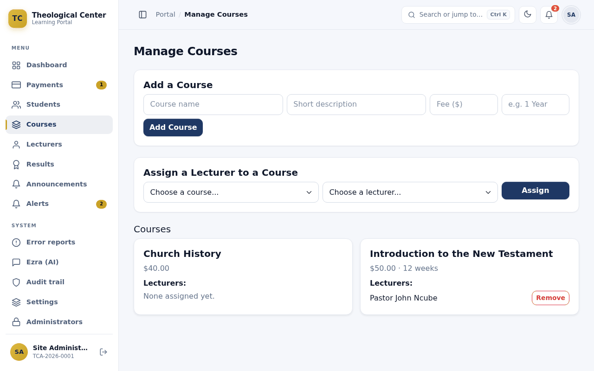

### Add a lecturer

1. Click **Lecturers**.
2. Under **Add a lecturer**, type their **Full name**, **Email** and **Phone (WhatsApp)**.
3. Click **Create**. A card appears with their login details and a temporary password (for example `Cedar-4827`).
4. Click **Send on WhatsApp** to send the details to them, or **Copy full message** to paste them elsewhere. The password is shown only once.
5. Then assign them to their courses (above).

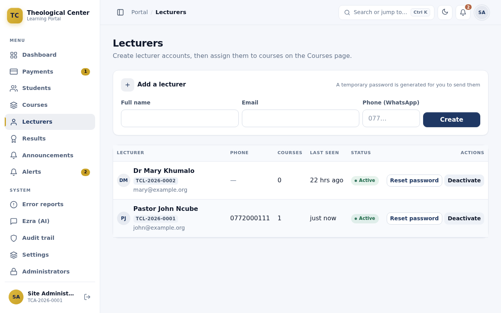

### Look after students

1. Click **Students**. Type in the search box to find someone by name, student number, email or phone.
2. Students who asked for a password reset are highlighted.
3. **Reset password**: creates a new temporary password and shows the WhatsApp card to send it.
4. **Deactivate**: stops them logging in (for example if they leave). **Activate** undoes it.
5. Click a student's name to open their card: edit their account and full profile, upload their photo, print or **Re-issue card** (a re-issued card gets a new QR code; the old one stops working).

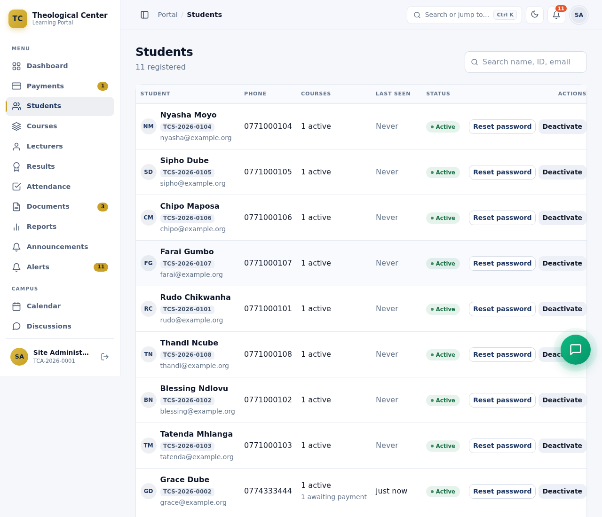

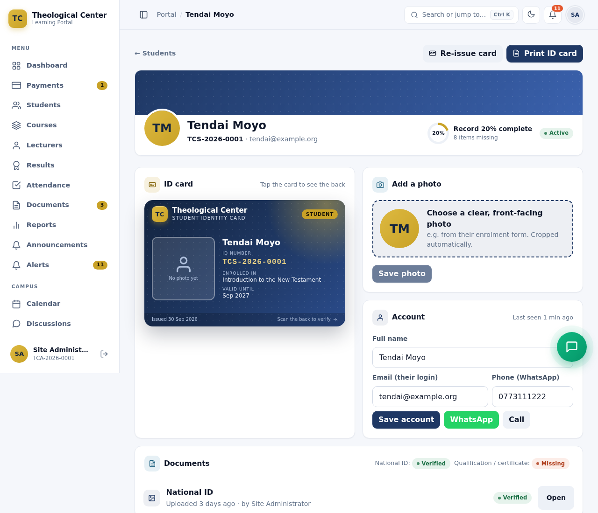

To download every student's details to Excel, press **Ctrl + K** and choose **Export all student details (CSV)**.

### Administrators

1. Click **Administrators**.
2. To add one, fill in **Add an administrator** and click **Create**, then send the temporary password on WhatsApp. Administrators can see every student's details and approve payments, so only add people you trust.
3. Click **Edit** to change anyone's name, login email or phone, including your own.
4. You can **Reset password** or **Deactivate** other administrators, never yourself, so there is always one admin left.

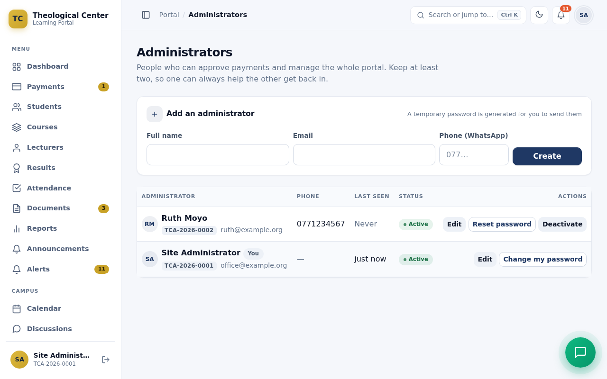

## 3. Announcements, results and settings

### Post an announcement

Announcements appear at the top of dashboards, for example "Semester 2 fees due 30 October".

1. Click **Announcements**.
2. Under **New announcement**, type a **Title** and **Message**.
3. Choose **Who sees it** (everyone, students or lecturers), how long to **Show for**, and a **Style** (Info, Good news or Important).
4. Click **Publish**.
5. To take it down early, click **Hide** (or **Delete**) on it in the list. **Show** puts it back.

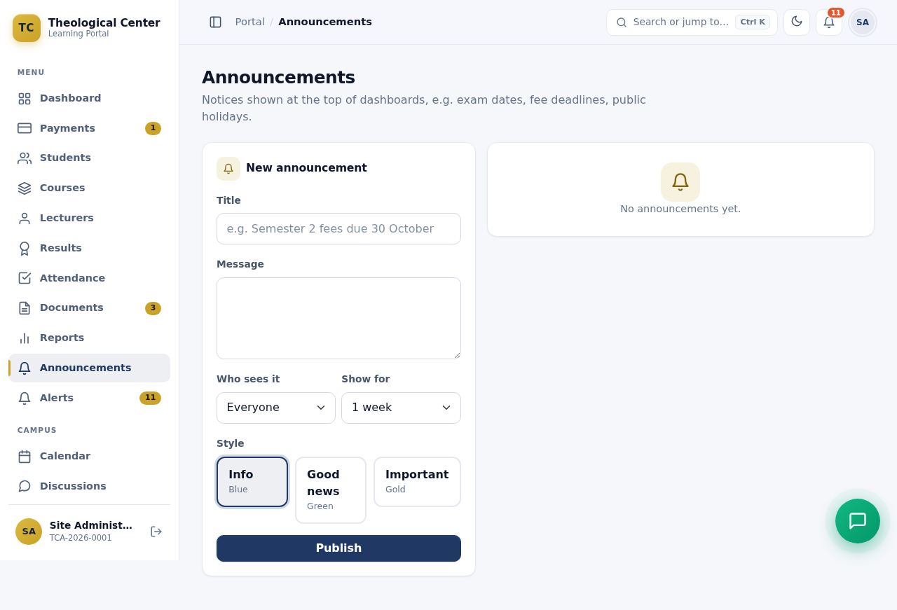

### Results overview

Lecturers publish results; administrators see how far each course has got and can export them.

1. Click **Results**. Each course shows its number of students, how many results are published, the average and when results were last published.
2. Click **View** to see a course's published results.
3. Click **Export all (CSV)** to download every published result to Excel (or export one course from its page).

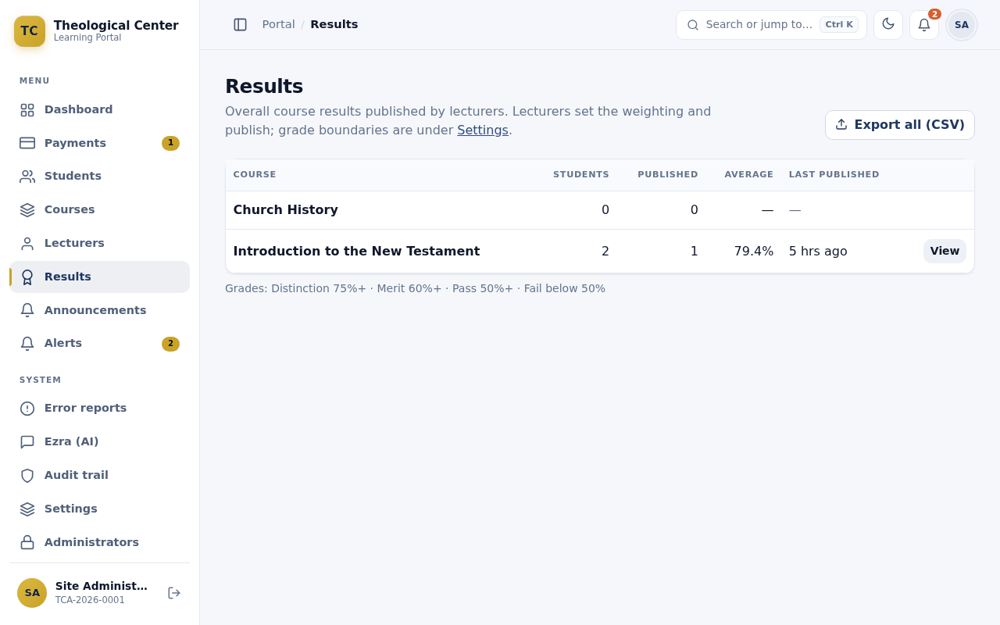

### Organisation settings

The details you enter here appear on receipts, ID cards, statements of results, the Help page and Ezra's answers.

1. Click **Settings**.
2. Fill in each group:
    - **Organisation**: full name, short name, tagline, logo initials, registration number
    - **Contact**: phone, WhatsApp, email, website, office hours
    - **Address**: street, city, province, country
    - **Payments**: the EcoCash and bank details students pay into
    - **Documents**: receipt footer, ID card validity and note, privacy notice
    - **Results**: grade boundaries (Distinction, Merit, Pass) and the note printed on statements
3. Click **Save settings**.

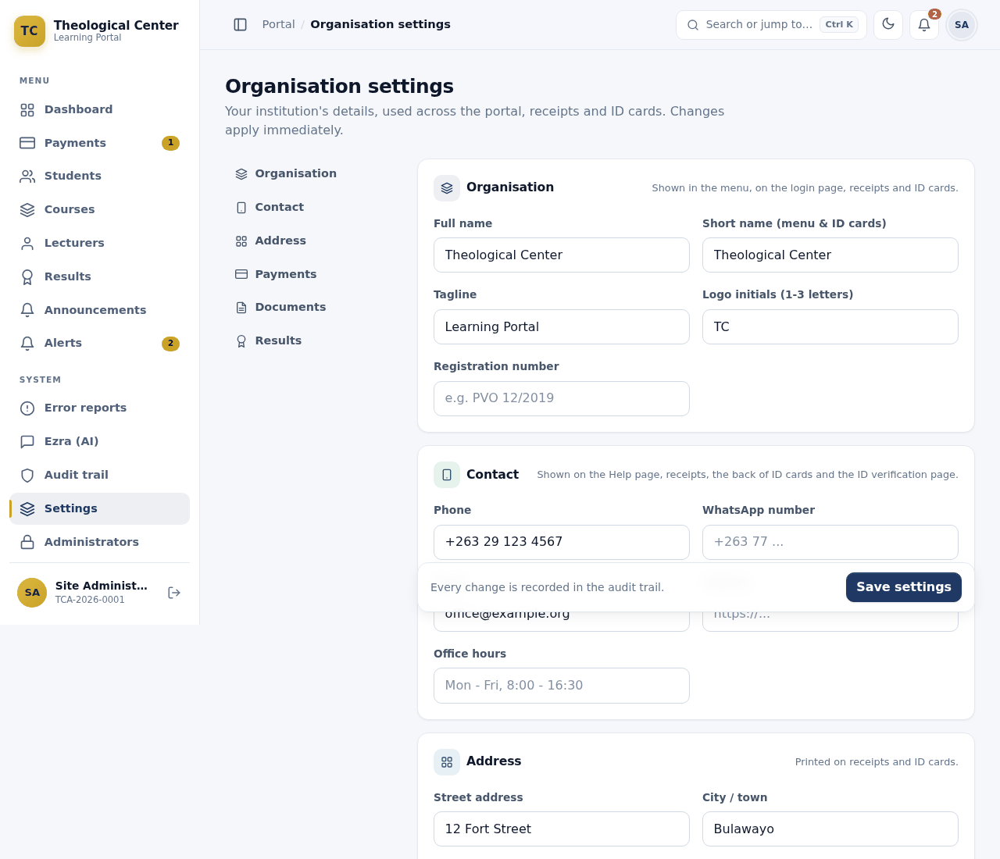

Grade boundaries must stay in order (Distinction ≥ Merit ≥ Pass). Changing them affects results published from then on.

## 4. Ezra (AI assistant)

Ezra is the students' AI study assistant. It is paid per question from credit bought in advance, so the admin page shows what it costs and lets you cap it. You see numbers only, never what students typed.

### Set up Ezra (once)

1. Go to **console.anthropic.com**, create an account, add a payment card and buy credit ($20 is enough to start). Under **Limits** you can set a monthly spend limit there too, as a second safety net.
2. Create an **API key** (Settings → API keys) and copy it. Treat it like a password.
3. On the server, copy `application/config/ezra.sample.php` to `application/config/ezra.php` and paste the key between the quotes of `$config['ezra_api_key']`.
4. In the portal, click **Ezra (AI)** and click **Test connection**. A green message confirms it works.

### Check spending

1. Click **Ezra (AI)**.
2. **This month** shows the amount spent against the limit, an estimate for the whole month, the number of answers, students using it, questions today and the average cost per answer.
3. The chart shows spending for the last 6 months; **Most active this month** lists students by number of questions.

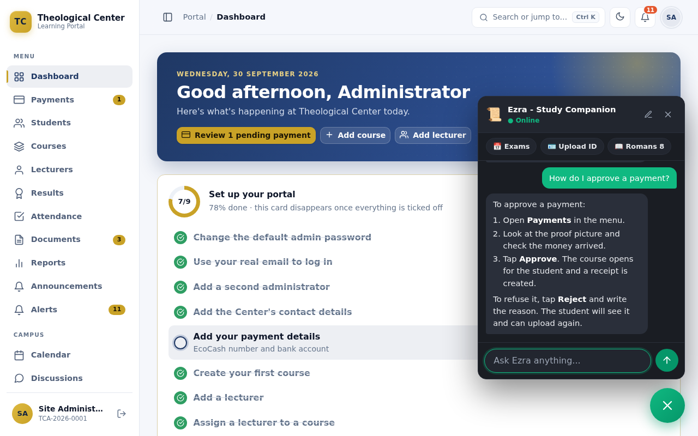

You get an alert when 80% of the monthly limit is used. At 100%, Ezra pauses for everyone until the 1st of the next month.

### Change Ezra's settings

1. On the Ezra page, go to **Settings**.
2. Change what you need:
    - **Ezra is switched on**: turn Ezra off for everyone.
    - **Who can use Ezra**: Students, and optionally Lecturers.
    - **Monthly limit ($)**: suggested $50 for under 100 students (about 1,500 answers).
    - **Questions per person a day**: suggested 25; 0 means no daily limit.
    - **AI model**: Claude Opus 5 gives the best answers; Claude Sonnet 5 costs about 60% less.
    - **Answer depth**: Quick is cheapest; Thorough costs more.
    - **Bible version quoted**: for example NKJV or KJV.
    - **Statement of faith Ezra follows**: starts from the Assemblies of God Statement of Fundamental Truths. Replace it with the Center's own wording.
    - **Keep conversations for (days)**: older conversation text is deleted automatically; costs are kept.
3. Click **Save settings**.

**Remove old conversations now** deletes the text of conversations older than the retention period straight away.

## 5. Documents (ID copies and qualifications)

Students and lecturers upload copies of their National ID, qualifications and certificates under **My documents**. You verify each one against their details.

### Verify or reject documents

1. Click **Documents** (the number shows how many are waiting). The **To verify** tab shows each document with a preview.
2. Click the preview to open the full file. Compare the name, ID number and photo with the person's card (click their name).
3. If it is correct, click **Verify**. The person is told.
4. If not, type the reason (for example "Photo is blurred") and click **Reject**. The reason is required; the person sees it and can upload a new copy.
5. The **Verified** and **Rejected** tabs keep the history. Use the filter for students or lecturers, or search by name or ID number.

Each student's and lecturer's card also has a **Documents** section where you can open, verify or reject their documents.

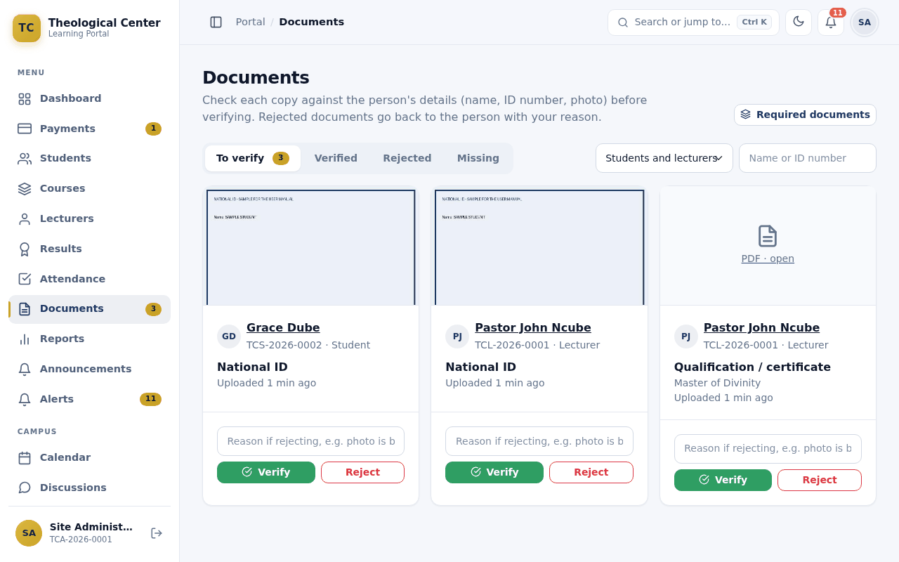

### Choose which documents are required

1. On the Documents page, click **Required documents**.
2. Tick what **Students must provide** and what **Lecturers must provide** (by default: National ID for students; National ID and a qualification for lecturers).
3. Click **Save required documents**. People see the list on their My documents page, with a red number on their menu until they upload.

### Chase missing documents

1. Click the **Missing** tab. It lists everyone still missing a required document (or whose copy was rejected).
2. Click **Remind** to send a ready-written WhatsApp message.

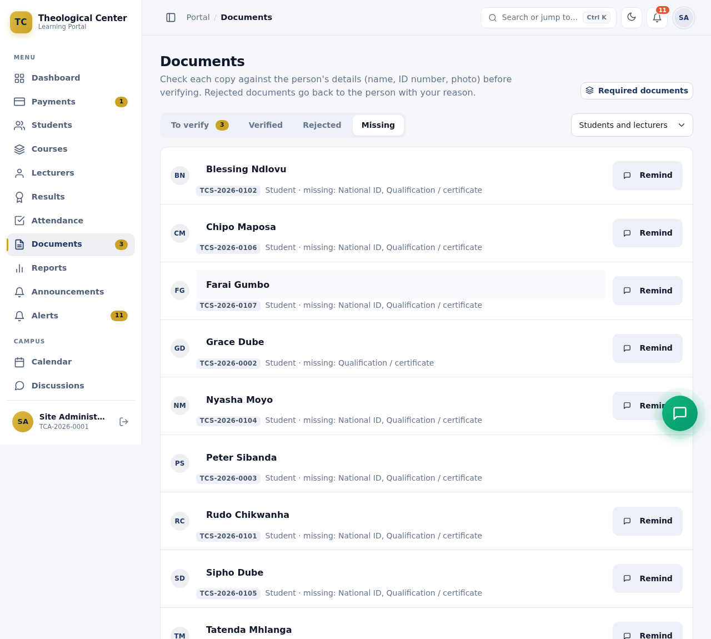

Opening someone's document is recorded in the audit trail. Documents are private: only the owner and administrators can open them.

## 6. Reports

Click **Reports** for figures for the board, churches and partners. Every report can be printed (or saved as PDF) with **Print / PDF**, and downloaded for Excel with **Export CSV**.

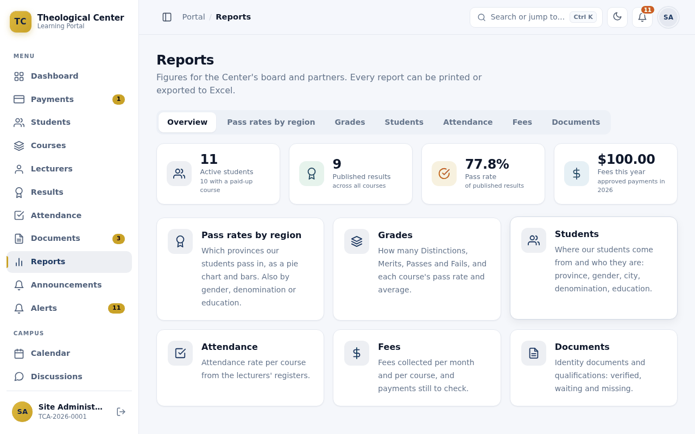

### Pass rates by province

1. Click **Reports**, then **Pass rates by region**.
2. The **pie chart** shows where the passes come from (each province's share of all passes). The **bars** show each province's pass rate: passed out of results published.
3. The table gives the numbers: results, passed, failed, pass rate and average mark per province.
4. Use **Group by** to see the same by gender, city, denomination, education or ministry role; **Course** and **Year** to narrow it down.

The province comes from each student's profile (My profile → About you). "Not given" means the student hasn't filled it in. A pass is a published result graded Pass, Merit or Distinction. Small groups swing a lot, so read the percentages together with the numbers.

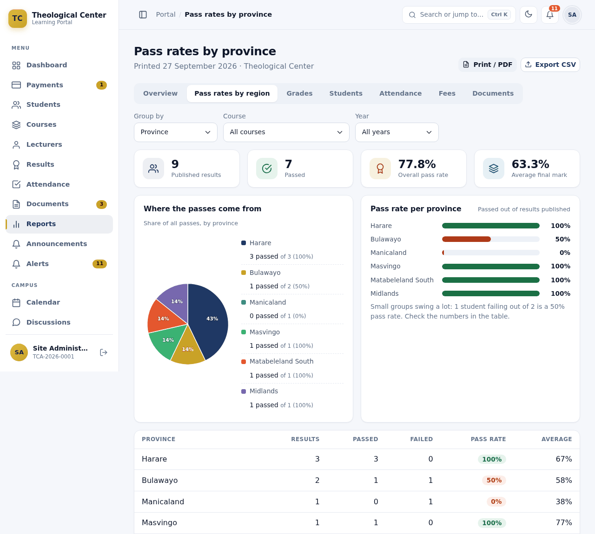

### The other reports

| Report | What it shows |
| --- | --- |
| Grades | How many Distinctions, Merits, Passes and Fails (donut), and each course's pass rate and average |
| Students | Students by province, gender, city, denomination, education or ministry role (pie + table); paid-up students or all accounts |
| Attendance | Attendance rate per course from the lecturers' registers |
| Fees | Fees collected per month (last 12 months or a chosen year), per course, and proofs still to check |
| Documents | Verified, waiting and rejected documents, and how many people are missing one |

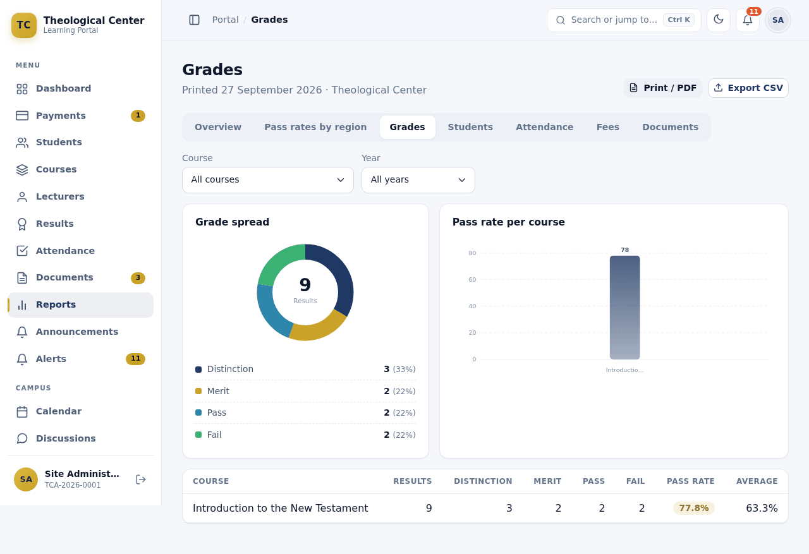

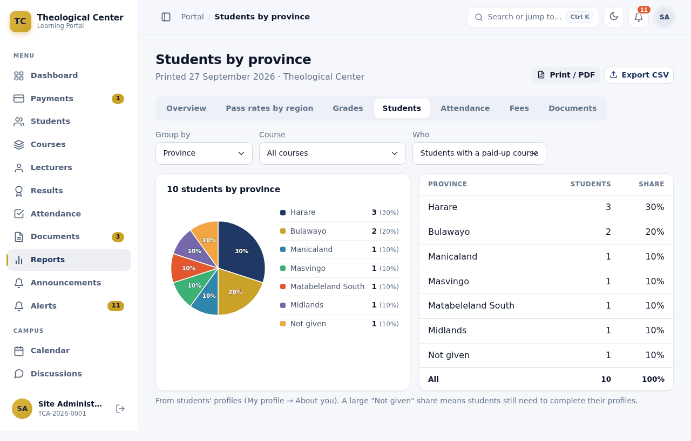

## 7. Calendar, attendance, discussions and library

- **Calendar**: click **Add event** to add college-wide events and holidays (choose **The whole college** under **For**), or events for any course. Tick **All day** and set **Until** for a holiday week.
- **Attendance**: every course's attendance rate at a glance. Click a course to see each student and every register, and **Export CSV** for Excel. Lecturers take the registers.
- **Discussions**: you can read, pin, close and delete posts on every board, including **General**.
- **Library**: add books, commentaries, sermons and recordings (file up to 20 MB, or a link) and remove any item.

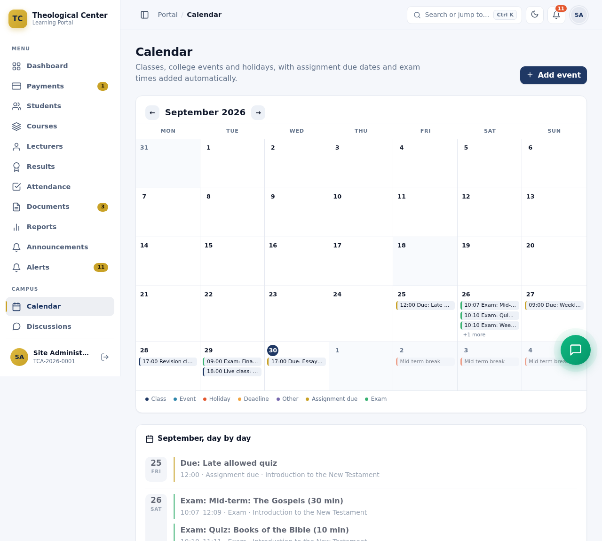

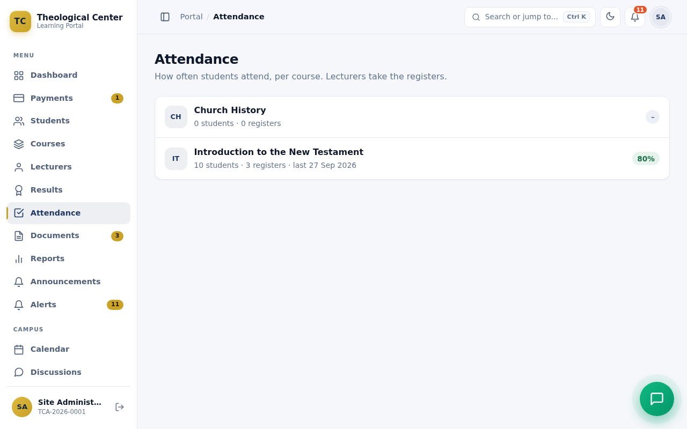

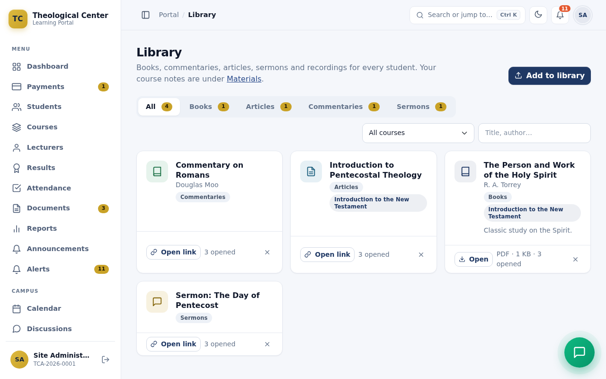

## 8. System health and troubleshooting

### Error reports

The portal records its own errors (and anything users report with **Report a problem**) with a reference like `ER-4F2A9C`. Repeats of the same error are grouped.

1. Click **Error reports** (a number shows serious open problems).
2. Use the tabs to see **Open**, **Resolved** or **Ignored** reports, and the source filter to narrow them.
3. Click a report to see what happened, where and to whom.
4. Mark it resolved or ignored, with a note. If a resolved error happens again, it reopens by itself.

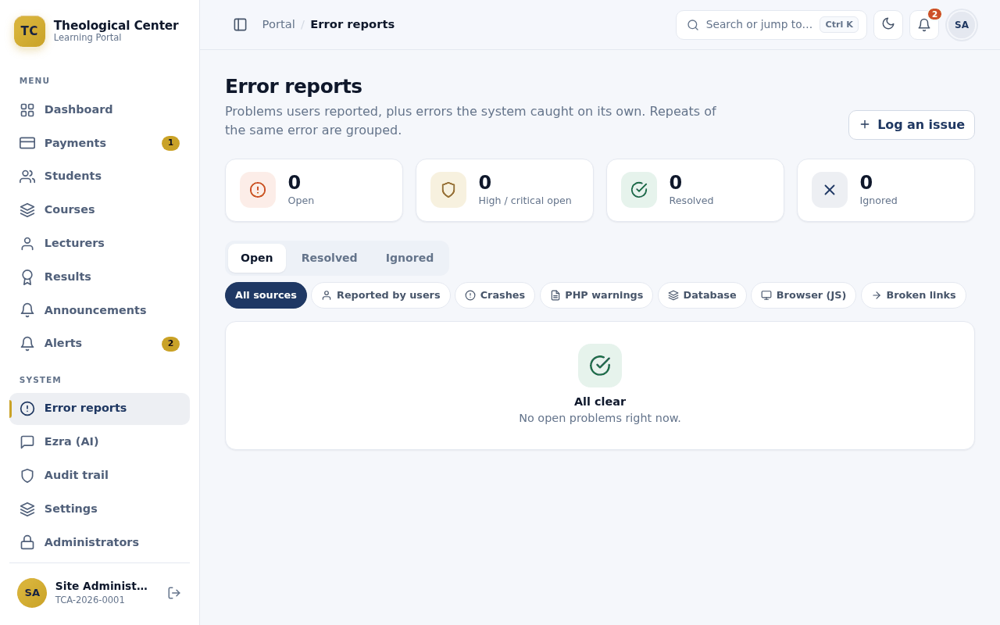

When a user quotes a reference number, search for it here. Send the technical details to the developer when you need a fix.

### Audit trail

Every important action is recorded: logins, approvals, marks, publishing, settings changes.

1. Click **Audit trail**.
2. Filter by **Area**, date (**From**) or **Search** (a name, action or IP address), then click **Filter**.
3. Click **Export CSV** to download the list to Excel.

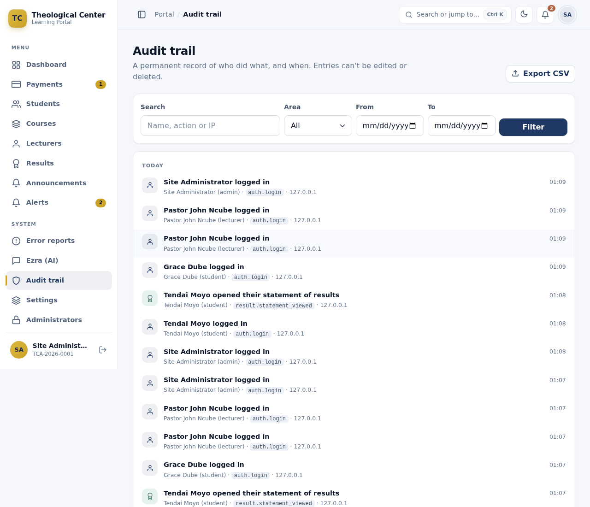

### Installing an update to the portal

When the developer delivers a new version that changes the database:

1. **Back up the database first**: open phpMyAdmin, choose the `theological_portal` database, click **Export**, then **Go**. Keep the file safe.
2. Install the new code.
3. Visit `/migrate` on the portal (for example `http://localhost/theological_portal/migrate`). It shows the new database version.
4. Check the main pages still work.

If a page says a feature "needs a database update first", step 3 hasn't been done yet.

### Common questions

| Question | Answer |
| --- | --- |
| A student forgot their password | Students → **Reset password**, then **Send on WhatsApp**. |
| Someone is "locked out" | 5 wrong passwords lock that email for 15 minutes. Wait, or reset their password. |
| I approved a payment by mistake | Contact the developer; approvals are recorded in the audit trail. |
| A lecturer can't see their course | Courses → **Assign a Lecturer to a Course**. |
| Emails aren't being sent | Email is off until the mail server is set up; alerts still show in the portal. |
| Ezra says it is being set up | The API key file `ezra.php` is missing, or PHP's cURL extension is off (the Ezra page explains which). |
| Ezra stopped for everyone | The monthly limit was reached. Raise it on the Ezra page, or wait for the 1st. |
