# Lecturer User Manual

**Version 2.0** · 27 September 2026 · for Portal v11 (adds Calendar, Discussions, Library, Attendance, Documents)

## Welcome

As a lecturer you teach through the portal: share materials, set and mark assignments, run online exams, and publish each student's final result. You only see the courses the office has assigned to you, and only students whose fees are approved.

What you can do:

- Post notes, readings, recordings and links (students are alerted)
- Set assignments with due dates, then mark them with feedback
- Create timed exams, watch students write them live, mark them and release results
- Set how assignments and exams count towards the final result, and publish results
- Remind students on WhatsApp with one tap

The portal works on a phone, but marking and setting exams is easier on a computer. Pictures in this manual show the computer view; on a phone, the same pages are reached from the bar at the bottom of the screen.

## 1. Getting started

### Your first login

The office creates your account and sends you a temporary password on WhatsApp (for example `Cedar-4827`).

1. Open the portal address and type your email and the temporary password.
2. Click **Log in**.
3. Click your initials (top right), then **My profile**.
4. Under **Change password**, type the temporary password, then your own new password twice, and click **Update password**.
5. While you are there, add a profile photo and check your WhatsApp number.

If you forget your password, click **Forgot password?** on the login page. The office resets it and sends you a new one.

### Your dashboard

The dashboard shows your courses, how many students are on each, your recent posts, and **work to mark** (assignments and exam scripts waiting for you).

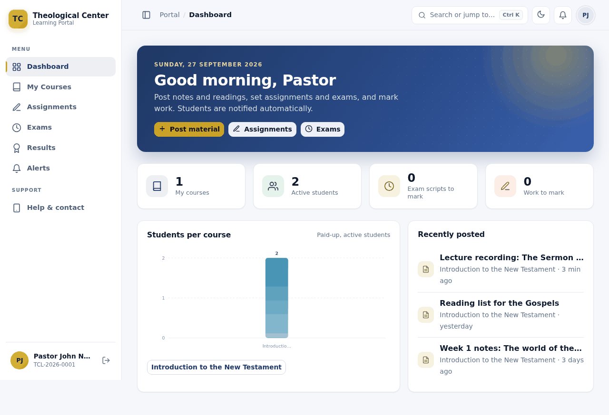

### Find your way around

| Menu item | What it's for |
| --- | --- |
| Dashboard | Overview and work to mark |
| My Courses | Post and delete materials for each course |
| Assignments | Set assignments and mark handed-in work (the number shows how many are waiting) |
| Exams | Create, invigilate and mark exams (the number shows scripts to mark) |
| Results | Weighting and publishing final results |
| Alerts | Messages from the portal |
| Help & contact | Office contact details |

- On a computer, the menu is on the left. Click the panel icon at the top to shrink it to icons.
- On a phone, use the bar at the bottom of the screen; **More** lists everything else.
- Press **Ctrl + K** (or click **Search or jump to...**) and type what you want, for example `invigilate` or `publish results`.

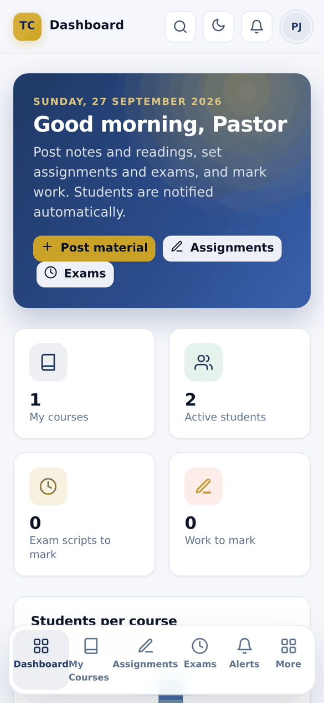

## 2. Materials and assignments

### Post a material

1. Click **My Courses** and open the course.
2. Under **Post New Material**, type a **Title** and, if you like, a **Description**.
3. Attach a **File** (PDF, Word, PowerPoint, audio...) or paste an **External Link** (for example a YouTube recording), or both.
4. Click **Post & Notify Students**. Every student with access gets an alert.

To remove a material, click **Delete** next to it under **Posted Materials**.

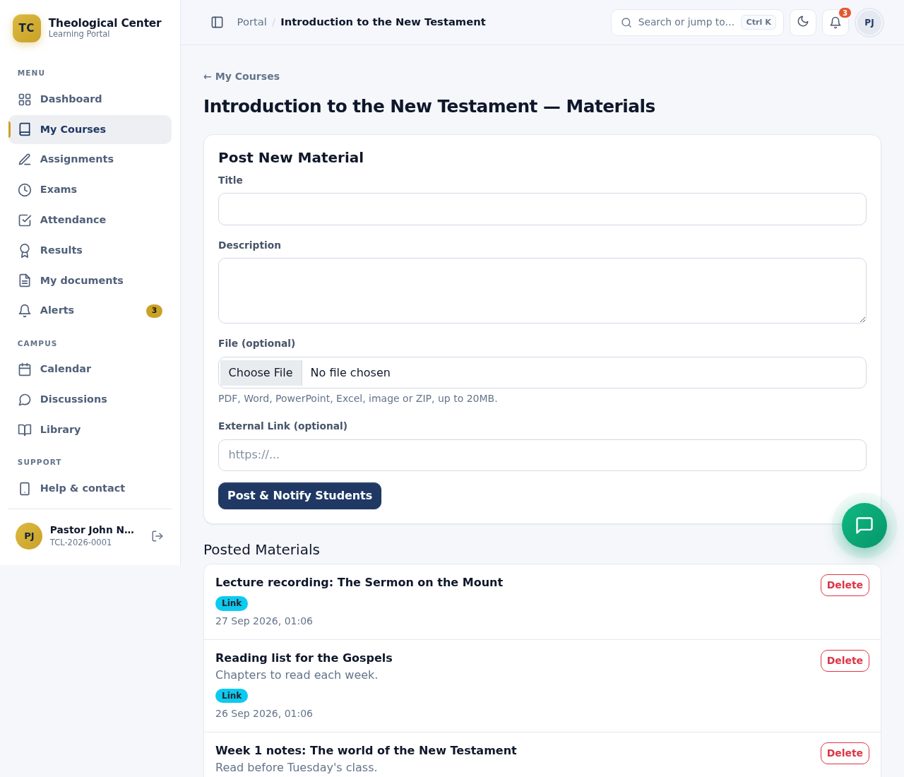

### Set an assignment

1. Click **Assignments**. Your courses are listed with their assignments.
2. Click **New assignment** on the course.
3. Fill in the **Title**, **Instructions**, **Due date and time** and **Marked out of** (for example 20).
4. Optionally attach a **Question paper or brief**.
5. Leave **Accept late work** on if students may still hand in after the due date (their work is labelled "Late"). Turn it off for a hard deadline.
6. Click **Set assignment & notify students**.

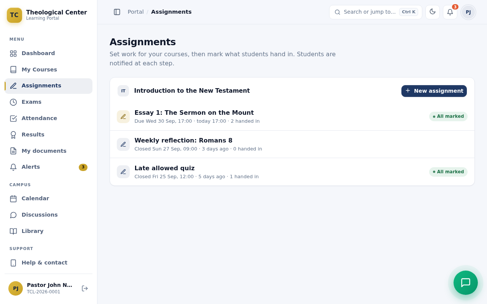

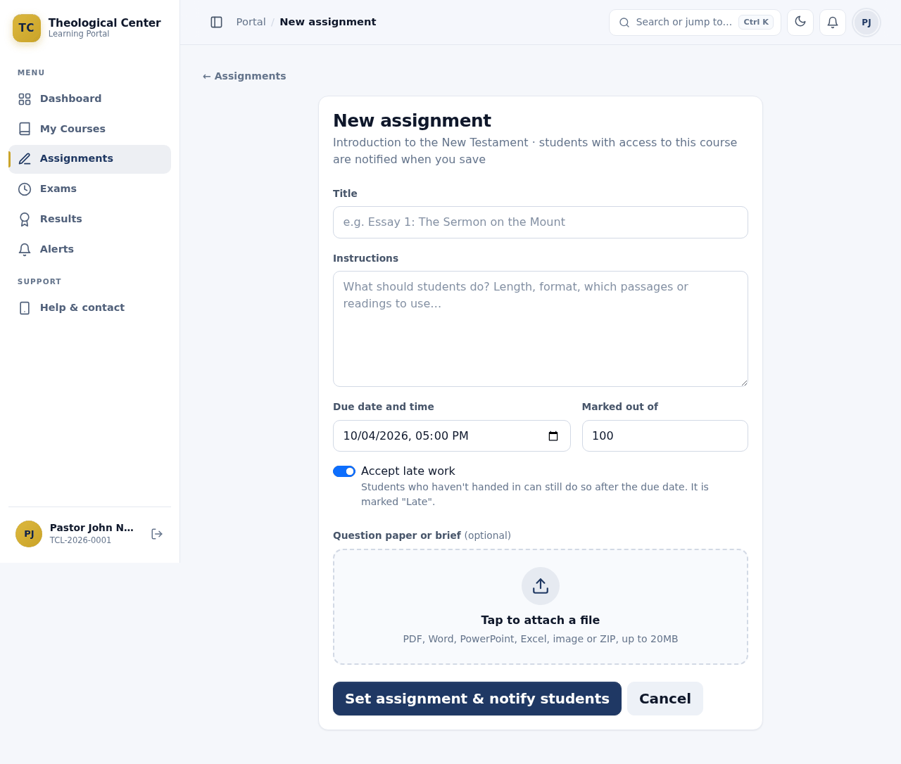

To change it later, open the assignment and click **Edit**. If you move the due date, students are told. An assignment can only be deleted while nobody has handed in.

### Mark handed-in work

1. Click **Assignments** (the number on the menu is how much is waiting) and open the assignment.
2. The top shows how many handed in, how many wait to be marked, and the average. Students waiting for a mark are listed first.
3. Click **Mark** next to a student. Open their file or read their typed answer.
4. Enter the mark and **Feedback for the student** (what was good, what to work on).
5. Click **Save mark & notify student**. To change a mark later, click **View**, edit it and click **Update mark** (the old mark is kept in the audit trail).

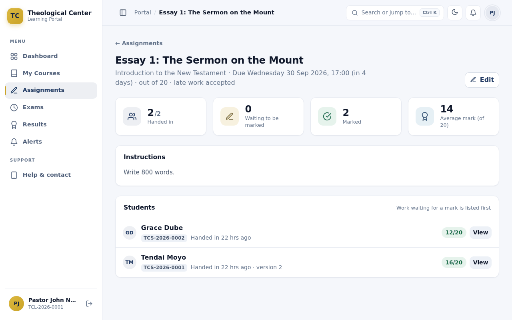

**Remind a student:** students who haven't handed in have a **Remind** button. It opens WhatsApp with a ready-written reminder to that student.

## 3. Exams

An exam goes through five steps: create it, add questions, publish it, invigilate while students write, then mark and release results.

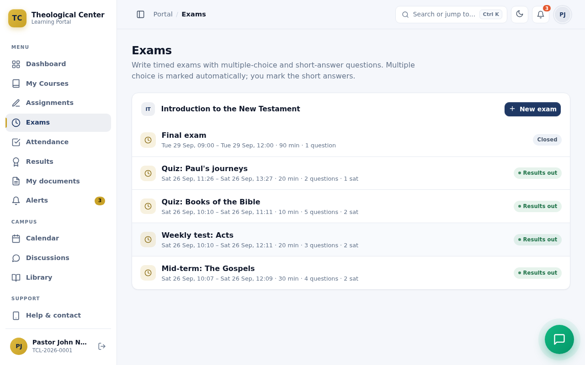

### Step 1: Create the exam

1. Click **Exams**, then **New exam** on the course.
2. Type a **Title** and **Instructions for students**.
3. Set when it **Opens** and **Closes**. Students can start any time in that window.
4. Set the **Time allowed (minutes)**. A student who starts late gets less time, because nobody can write after it closes.
5. **Questions per student**: leave it empty to give everyone all questions, or enter a number (for example 20 out of 40) so each student gets a random selection.
6. Leave **Shuffle questions and choices for each student** on, so neighbours can't share answers.
7. Click **Create & add questions**.

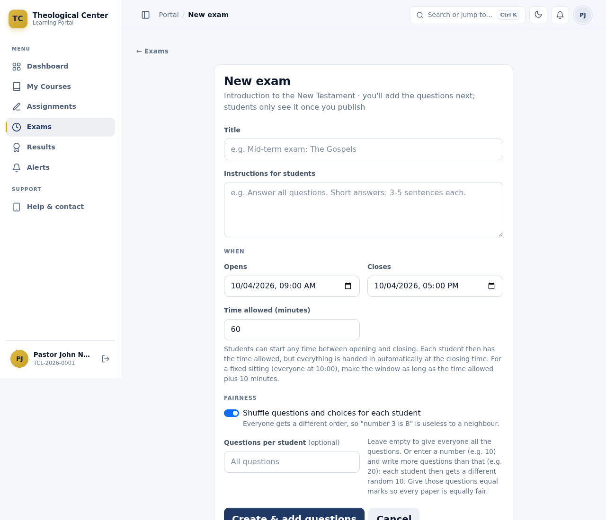

### Step 2: Add questions

1. On the exam page, under **Questions**, click **Multiple choice** or **Short answer**.
2. Type the **Question** and its **Marks**.
3. For multiple choice, type 2 to 6 choices and tick the correct one. These are marked automatically.
4. Short answers are marked by you after the exam.
5. Click **Save & add another** to keep going, or **Save & finish**.
6. Use the arrows to reorder questions. Questions lock once any student has started.

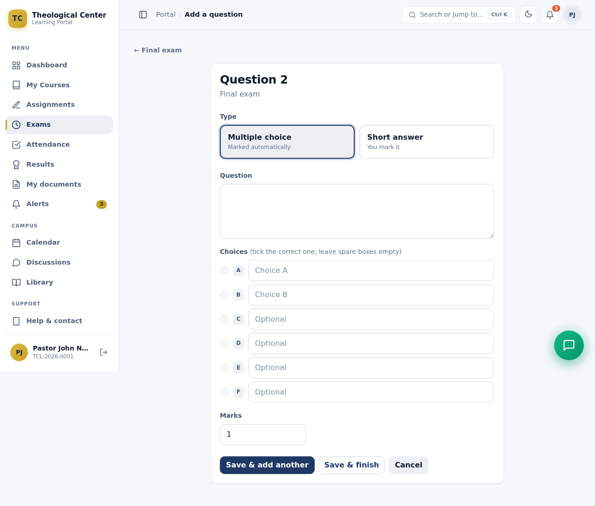

### Step 3: Publish

1. On the exam page, click **Publish exam**. The portal lists anything missing in plain words (for example, no questions yet).
2. Students are alerted and see the exam under **Coming up** or **Open now**.
3. You can click **Back to draft** or **Delete exam** only before anyone starts.

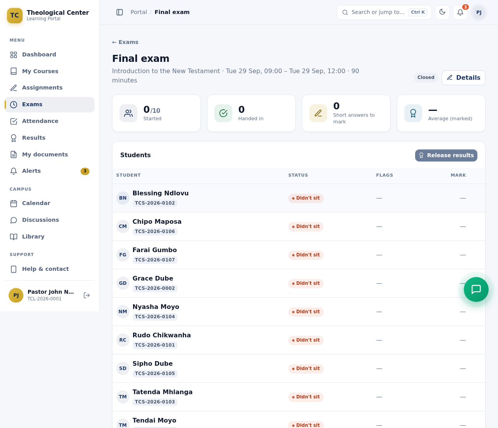

### Step 4: Invigilate live

1. On the exam page, click **Invigilate live**. The page refreshes itself every 10 seconds.
2. The counts show who hasn't started, who is writing, who has handed in, and who has flags.
3. Each student row shows answered questions, time left, "no signal" if their phone has gone quiet, and flags with time away.
4. Click **Details** to open a student's script and activity log.
5. If a student's phone dies, click **New device** on their row. They log in on another phone and continue; saved answers are kept and the timer keeps running.
6. The WhatsApp button lets you message a student straight away.

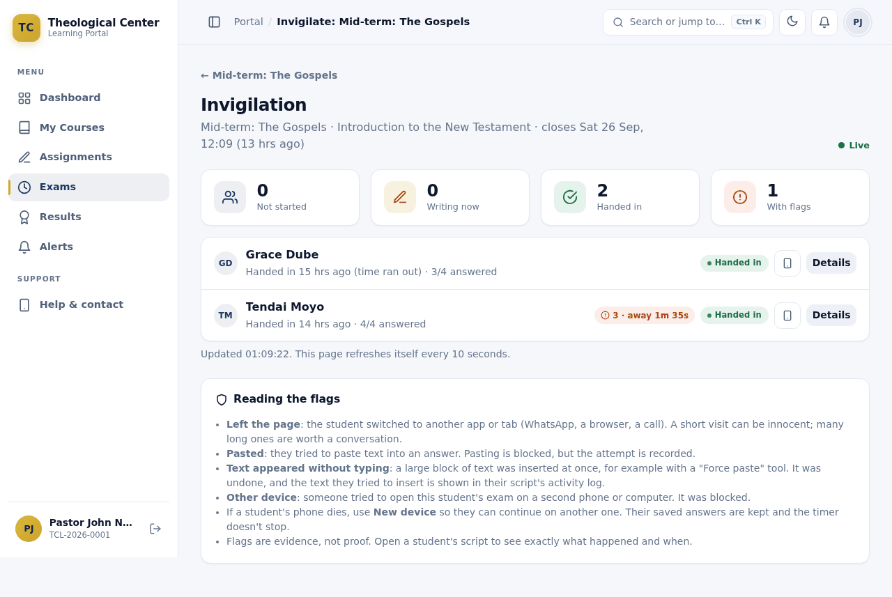

What the flags mean: **Left the page** (switched to another app), **Pasted** (tried to paste; blocked), **Text appeared without typing** (a large block inserted at once, undone), **Other device** (someone tried to open the exam on a second phone; blocked). Flags are evidence, not proof: open the script and look at the activity log before deciding anything.

### Step 5: Mark and release results

1. Multiple-choice questions are marked automatically when a student hands in. Papers with only multiple choice are fully marked straight away.
2. For short answers: on the exam page, open a student's script, give a **Mark** for each short answer and overall feedback.
3. Click **Save marks**, or **Save & next script** to move straight on to the next student.
4. When nobody is still writing and every script is marked, click **Release results** on the exam page.
5. Students are alerted and can see their mark, your feedback and the correct answers. If you change a mark after release, the student is told.

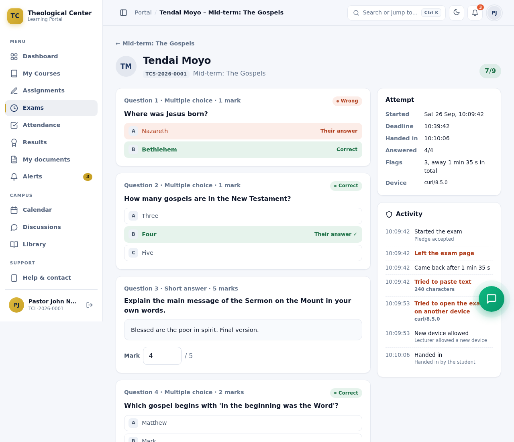

## 4. Results

The portal works out each student's final result from their marks; you choose the weighting, add remarks, and publish.

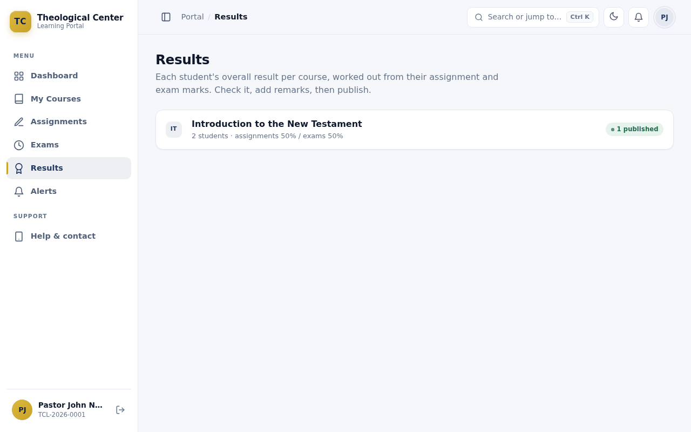

### How results are worked out

- **Assignments:** the average of the student's percentage on each assignment whose due date has passed. Not handed in counts as 0%.
- **Exams:** the average of their percentage on each exam that has closed. Not sat counts as 0%.
- **Final** = assignments × their weight + exams × their weight. If a course has only assignments or only exams, that part counts 100%.
- **Grade** comes from the boundaries the office sets (by default Distinction 75%, Merit 60%, Pass 50%).

### Set the weighting

1. Click **Results** and open the course.
2. Under **Weighting**, drag the slider to set how much assignments count (exams get the rest). The default is 40% assignments, 60% exams.
3. Click **Save weighting**. Everyone's calculated result updates.

### Publish results

1. On the course's results page, each student shows their assignment %, exam %, final % and grade.
2. A student marked **Not ready** has work still to finish, for example handed-in work not yet marked, or exam results not released. Finish that first.
3. Click **Show the marks this is based on** to check the detail.
4. Type **Remarks for the student** if you like (for example "Excellent grasp of the Gospels").
5. Tick the students to publish (new and changed results are ticked for you).
6. Click **Publish ticked results** and confirm. Each student is alerted and sees their result and remarks.

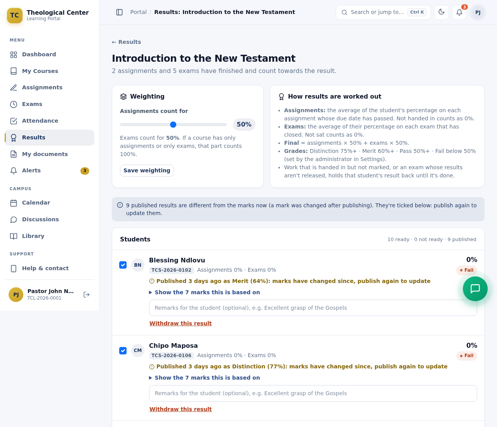

**If a mark changes after publishing,** the row is highlighted and ticked. Publish again and the student is told their result was updated.

**To take a result back,** click **Withdraw this result** under the student and confirm. The student can no longer see it and is told it is under review.

## 5. Attendance

Take a register for each class. Students see their own attendance, and the office sees every course.

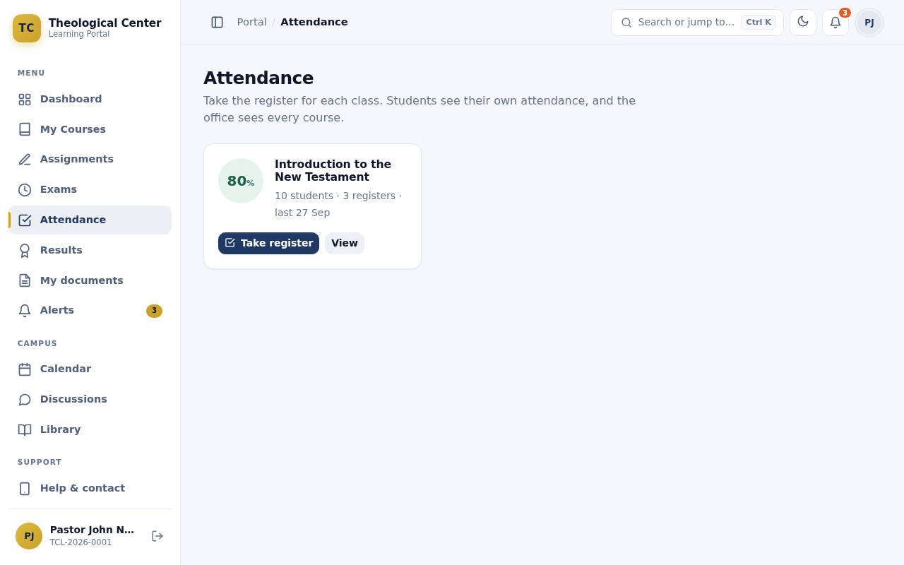

### Take the register

1. Click **Attendance**, then **Take register** on the course.
2. Check the **Date of the class** and type the **Topic** (optional).
3. Everyone starts as **Present**. Click **Late**, **Absent** or **Excused** for the others. Add a **Note** if useful (for example "hospital").
4. **All present** and **All absent** set everyone at once; the line above the list counts each mark.
5. Click **Save register**.

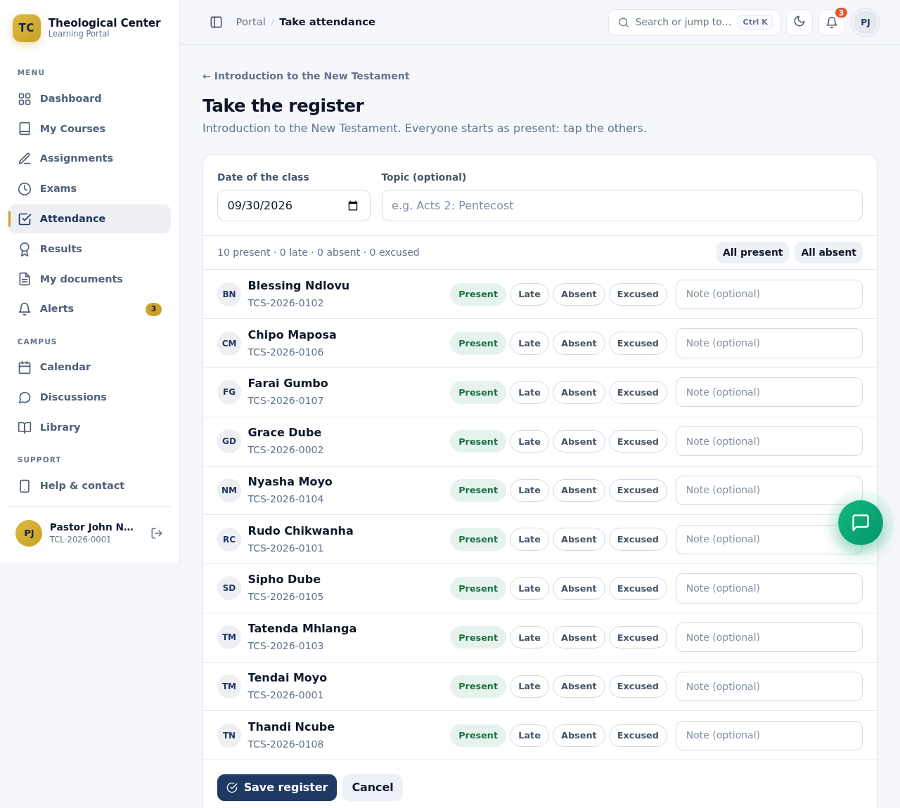

### See who is falling behind

1. Click **Attendance**, then **View** on the course.
2. **Students** lists everyone's rate, lowest first: present + late out of the classes they were marked for (excused absences don't count).
3. Students below 75% get a WhatsApp button so you can check in on them.
4. **Registers** lists every class. Click **Edit** to correct a register, or delete it from there.

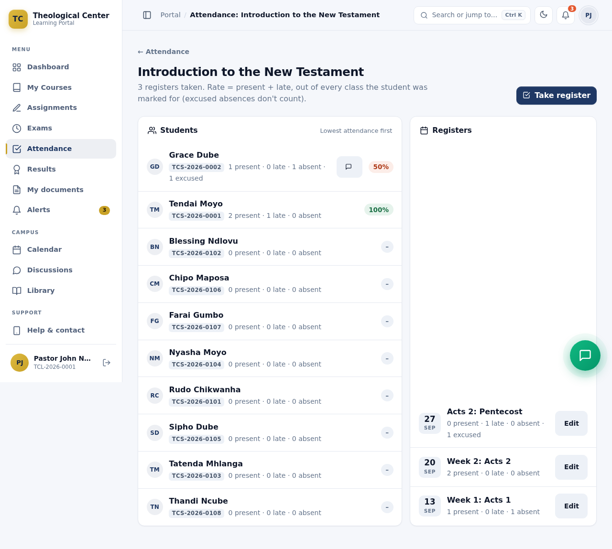

## 6. Calendar, discussions and library

### Add a class or event to the calendar

Assignment due dates and exam times appear on the calendar by themselves. Add your classes and other events:

1. Click **Calendar**, then **Add event** (or click an empty day).
2. Type a **Title** and choose the **Kind** (Class, Event, Holiday, Deadline, Other) and the course.
3. Set the **Date**, the **Starts** and **Ends** times, or tick **All day**. Use **Until** for events that last several days.
4. Add **Where** (for example "Main hall" or "Online") and an **Online meeting link** (Google Meet, Zoom, WhatsApp) if the class is online. Students get a **Join online** button.
5. Click **Add to calendar**. Students on the course are alerted, and again if you change the time.

To change or remove an event, click **Edit** next to it in the day-by-day list.

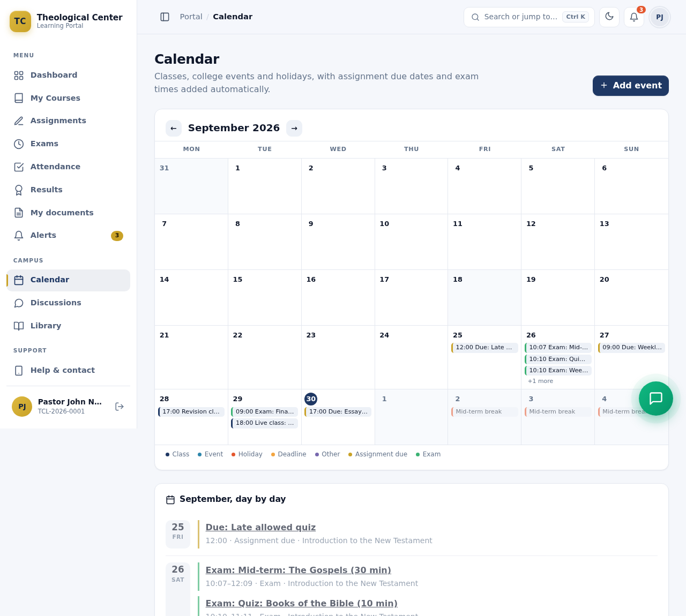

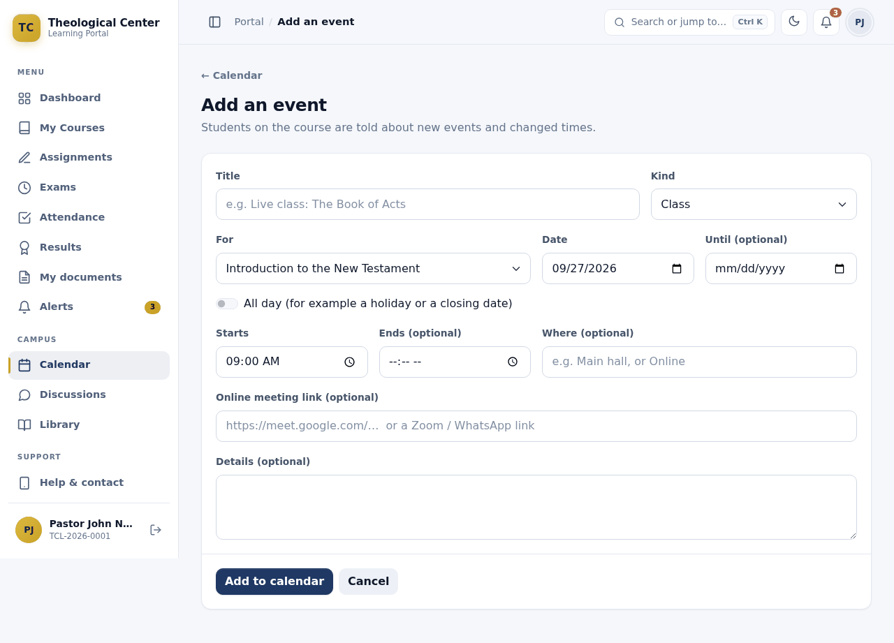

### Run your course discussions

1. Click **Discussions**. Each course has a board; **General** is for the whole college.
2. You get an alert when a student asks a question on your course board. The dashboard lists **Questions waiting for a reply**.
3. Open a topic and reply. Your posts carry a **Lecturer** tag.
4. On your courses' boards (and General) you can **Pin** a topic to the top, **Close replies**, or delete a topic or reply.
5. When you start a topic on a course board, every student on the course is alerted, which is useful for announcements and discussion questions.

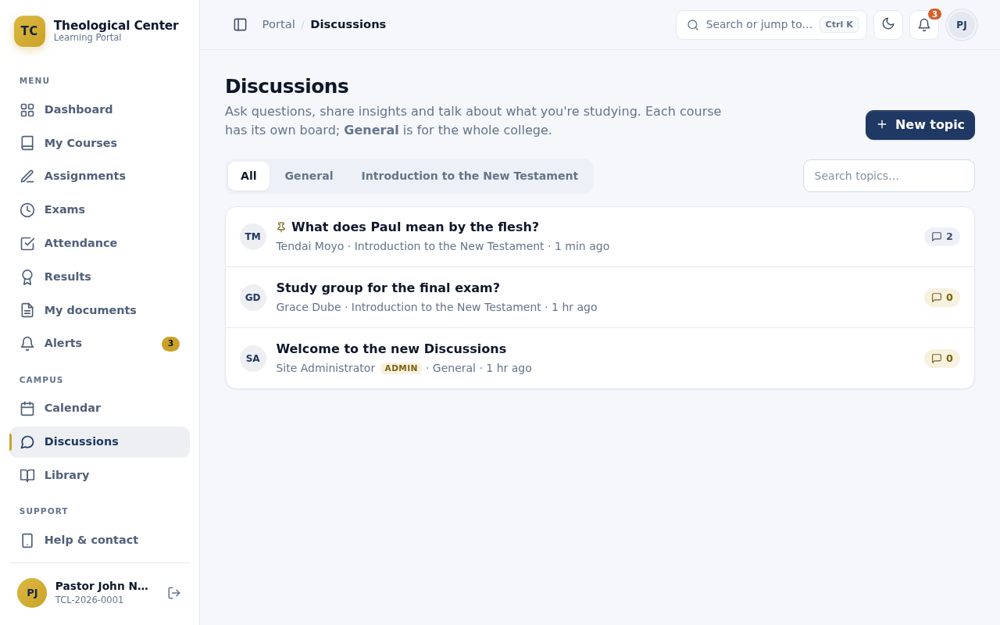

### Add to the library

1. Click **Library**, then **Add to library**.
2. Type the **Title**, **Author / speaker**, choose a **Category**, and optionally the course it is **Recommended for**.
3. Choose a **File** (PDF, Word, PowerPoint, EPUB, audio or video, up to 20 MB) or paste a link.
4. Click **Add to library**. Only share material the Center is allowed to share.

You can remove items you added (the **×** on the card).

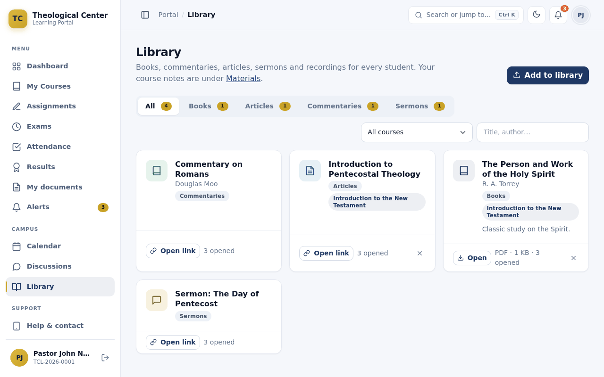

## 7. My documents

The office asks lecturers for a copy of their **National ID** and **qualifications**.

1. Click **My documents** (a red number means something is still needed).
2. Choose what the document is, add a description (for example "Master of Divinity, 2015"), choose the file (PDF, JPG or PNG, up to 5 MB) and click **Send to the office**.
3. You are alerted when it is verified, or told why it wasn't accepted so you can upload a new copy.

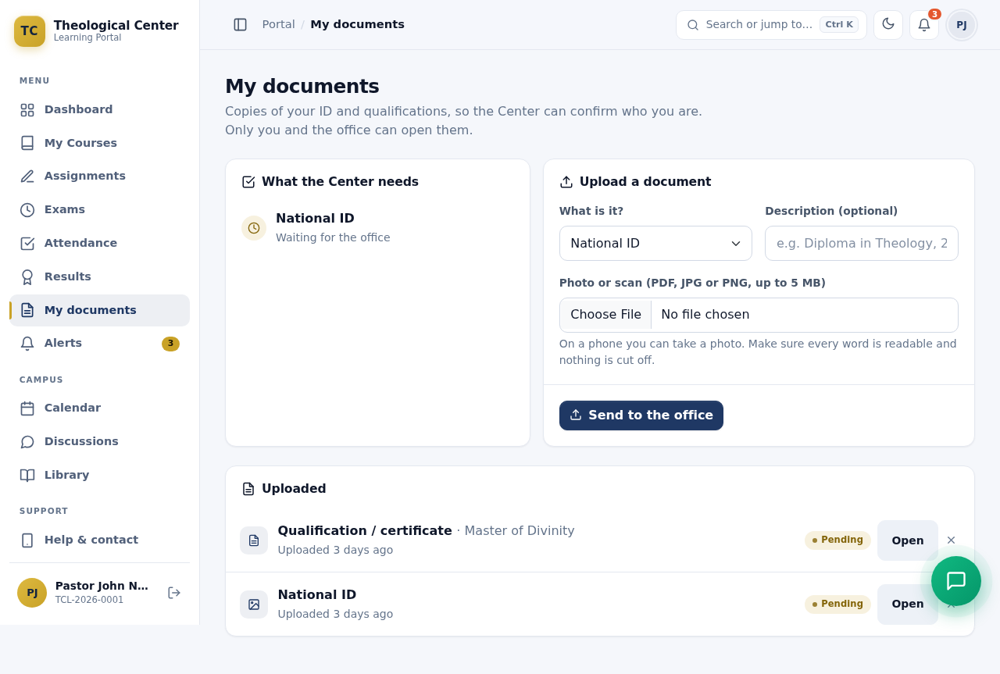

## 8. Profile, help and troubleshooting

### Your profile and staff ID card

1. Click your initials (top right), then **My profile**.
2. Add a **Profile photo** (click it, choose or take a photo, **Save photo**).
3. Update your name, email or WhatsApp number under **Account details**, then **Save details**.
4. Change your password under **Change password**.
5. **My ID card** shows your staff number (for example `TCL-2026-0001`) with a QR code; click **Print** to print it.

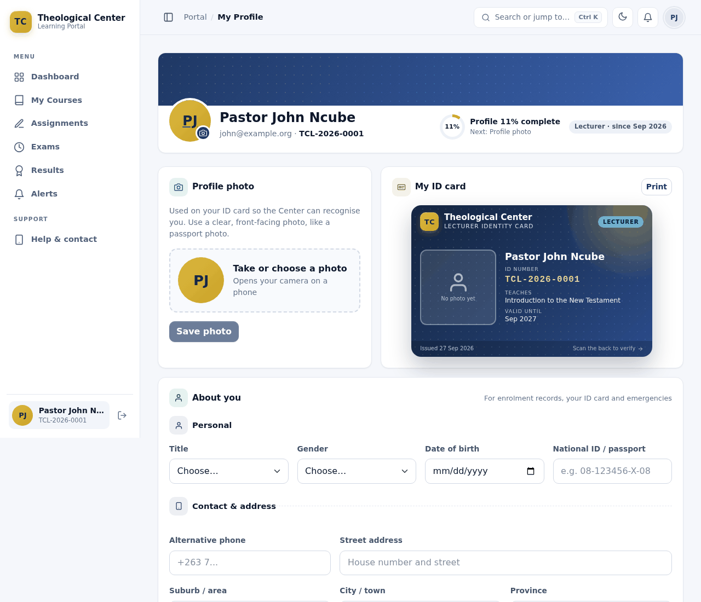

### Getting help

- **Help & contact** (in the menu) has the office's WhatsApp, phone and email.
- **Report a problem** (search for it with Ctrl + K) sends a description of what went wrong to the administrators and gives you a reference number.

### Common questions

| Question | Answer |
| --- | --- |
| I can't see a course | The office assigns lecturers to courses. Ask them to add you. |
| A student says they can't see my material | Their fee may not be approved yet; only paid-up students have access. |
| Can I delete an assignment? | Only before anyone has handed in. Otherwise edit it instead. |
| A student's phone died mid-exam | Open **Invigilate live** and click **New device** on their row. |
| Can I give one student extra time? | Not yet. Extending the closing time doesn't change the deadline of students already writing. |
| I can't release exam results | Nobody may still be writing, and every script must be marked. The message on screen says which is missing. |
| A result says "Not ready" | It tells you why: mark the outstanding work or release the exam results first. |
