# Student User Manual

**Version 2.1** · 30 September 2026 · for Portal v12 (Ezra is now a chat button on every page)

## Welcome

The Learning Portal is where you study with the Center: apply for courses, pay fees, download materials, hand in assignments, write exams and see your results, all from your phone or computer. It replaces sending work over WhatsApp.

What you can do in the portal:

- Apply for one or more courses and upload proof of your fee payment
- Download course materials once your payment is approved
- Hand in assignments and read your lecturer's marks and feedback
- Write timed online exams
- See your results and print a statement of results
- Ask **Ezra**, the study companion in the green chat button, how to do things in the portal, and about the Bible
- Keep your profile, photo and student ID card up to date

The portal works on any phone browser (Chrome, Safari, Samsung Internet). Pictures in this manual show the phone view; on a computer the same menu sits on the left of the screen.

## 1. Getting started

### Create your account

1. Open the portal address the Center gave you (for example `https://portal.yourcollege.org`) in your phone's browser.
2. On the login page, tap **Create an account**.
3. Fill in your full name, email address, phone (WhatsApp) number, and a password of at least 6 characters. Type the password again under Confirm password.
4. Read the privacy notice and tick the box to agree.
5. Tap **Create account**. You are logged in straight away and your student number (for example `TCS-2026-0001`) is created.

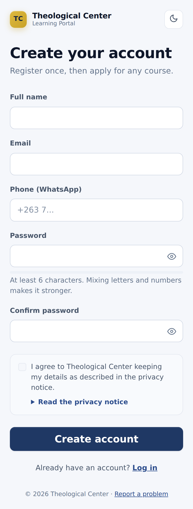

### Log in

1. Open the portal address.
2. Type your email address and password.
3. Tap **Log in**. You stay logged in on that phone for 3 days.

If you type the wrong password 5 times, your account is locked for 15 minutes. Wait, then try again.

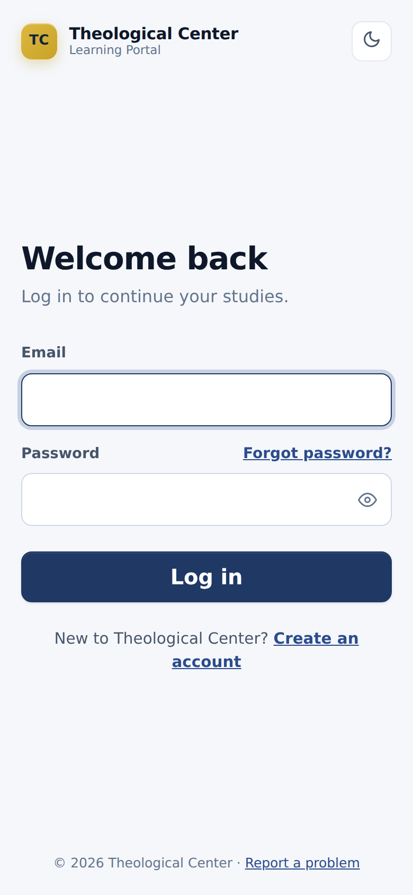

**Forgot your password?** Tap **Forgot password?** on the login page and enter your email. The office is told, resets it, and sends you a new password on WhatsApp. Change it under **My profile** once you are in.

### Find your way around

Your **Dashboard** is the first page after logging in. It shows an **Ezra tip of the day**, a checklist to get you started, what is due soon, your upcoming exams and new materials. The green chat button at the bottom right is **Ezra**, who can help you on every page (see section 4).

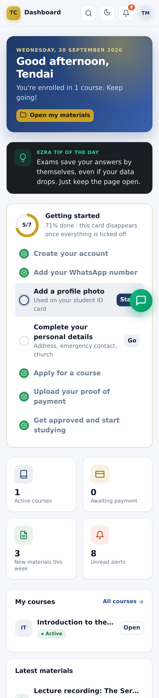

On a phone, the bar at the bottom of the screen takes you to the main pages:

| Button | Opens |
| --- | --- |
| Dashboard | Your home page |
| Assignments | Work to hand in, and your marks (the red number is how many are waiting) |
| Exams | Online exams, open now or coming up |
| Materials | Notes, readings and recordings for your courses |
| Alerts | Messages from the portal and your lecturers |
| More | Everything else: Courses, Results, Payments, your profile |

1. Tap **More** (bottom right) to see every page.
2. Start typing to search, for example `receipt` or `results`.
3. Tap the page you want.

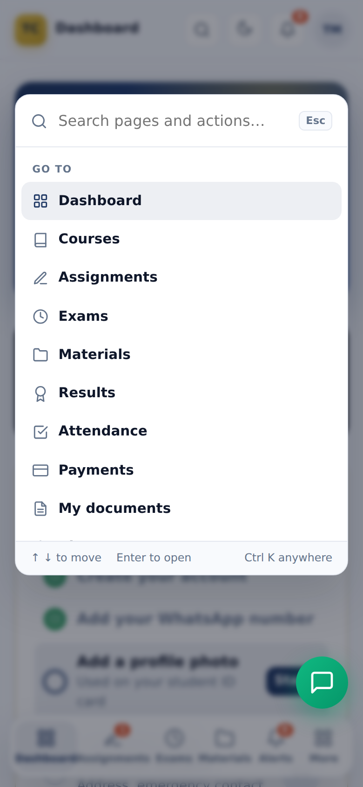

Other buttons at the top of every page:

- **Magnifying glass**: the same search as More. On a computer, press **Ctrl + K**.
- **Moon / sun**: switch between dark and light mode.
- **Bell**: your alerts, with a red number when something is new.
- **Your initials** (or photo): your profile, ID card and **Log out**.

**Tip:** add the portal to your home screen so it opens like an app. In Chrome, tap the three dots, then **Add to Home screen**.

## 2. Courses and payments

A course opens for you once the office approves your proof of payment. You can study several courses at once.

### Apply for a course

1. Tap **More**, then **Courses**.
2. Find the course you want. Each card shows the fee, the length and the lecturer.
3. Tap **Apply now** and confirm.
4. The card now says **Awaiting payment**.

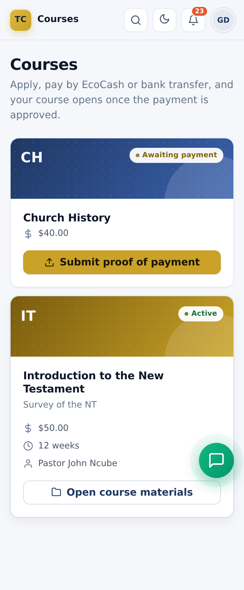

### Pay and upload your proof of payment

1. Pay the course fee by **EcoCash** or **bank transfer**, using the details the Center gave you (they are also on the **Help & contact** page).
2. Take a screenshot of the EcoCash confirmation message, or a photo of the bank slip.
3. In the portal, go to **Courses** and tap **Submit proof of payment** on that course.
4. Choose **EcoCash** or **Bank transfer**.
5. Tap **Tap to choose a file** and pick your screenshot or PDF (up to 4 MB). A preview appears.
6. Tap **Submit for review**.

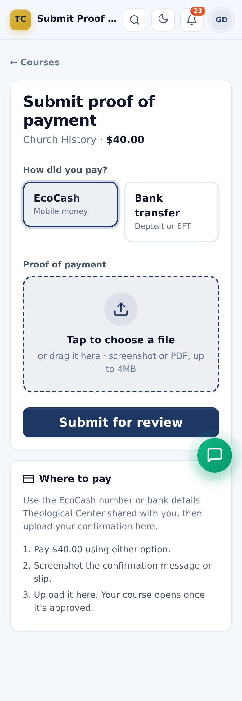

What happens next:

- **Approved:** you get an alert, the course card says **Active**, and its materials open.
- **Rejected:** you get an alert with the reason (for example, the amount was wrong). Fix it, then tap **Upload again** on the course.

### See your payments and print a receipt

1. Tap **More**, then **Payments**.
2. Each payment shows its course, amount and status.
3. For an approved payment, tap **Receipt** to open it, then **Print** (or save as PDF).

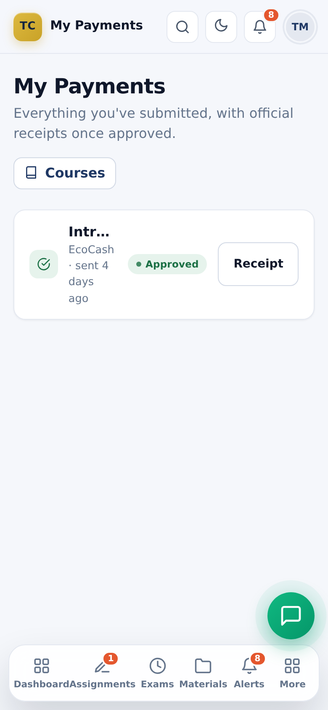

## 3. Materials, assignments and exams

### Open course materials

1. Tap **Materials** in the bottom bar.
2. Tap the course.
3. Tap a material to open or download it. Some are files (PDF, Word, audio), others are links to a website or recording.

You get an alert whenever your lecturer posts something new.

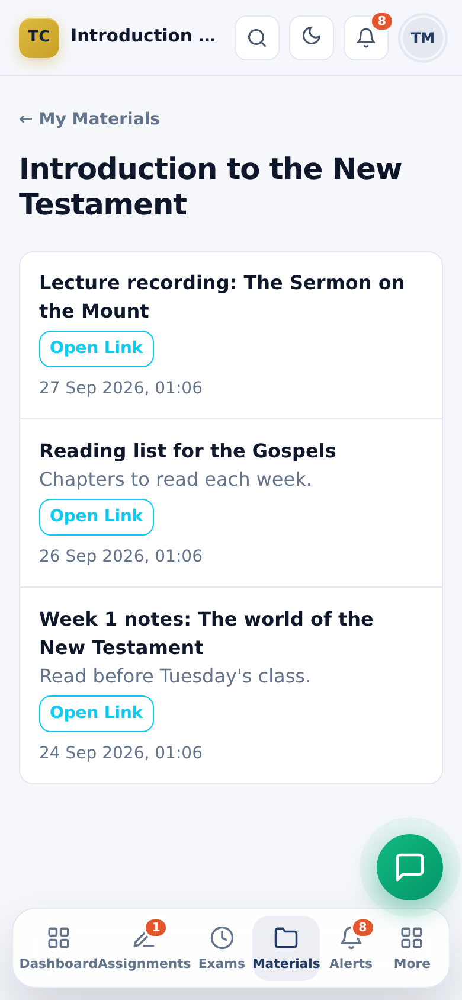

### Hand in an assignment

1. Tap **Assignments** in the bottom bar. **To hand in** lists work that is due, with the due date. Red means overdue.
2. Tap the assignment to read the instructions. Download the question paper if there is one.
3. Under **Hand in your work**, attach your document (up to 10 MB), type your answer in the box, or both.
4. Tap **Hand in**. You get a confirmation and the assignment moves to **Handed in & marked**.

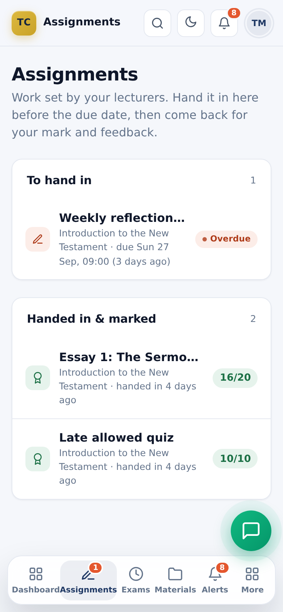

Rules to know:

- Until the due date you can hand in a new version as often as you like (**Replace my work**). The newest version is the one marked.
- After the due date, work is only accepted if the lecturer allows late work, and it is marked as late.
- Once your work is marked, it can't be changed.

### See your mark and feedback

1. You get an alert when your work is marked.
2. Open **Assignments** and tap the assignment under **Handed in & marked**.
3. Your mark, percentage and your lecturer's feedback are shown at the top.

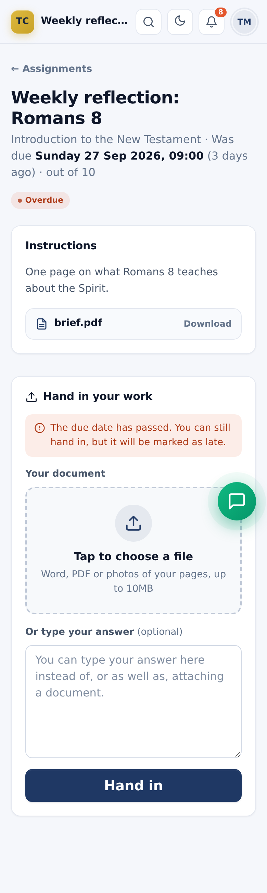

### Write an online exam

Exams are timed. Once you start, the clock keeps running even if you close the page, so start only when you are ready and have a good signal.

1. Tap **Exams** in the bottom bar. **Open now** exams can be started; **Coming up** shows when others open.
2. Tap the exam and read the rules: how long you have, and when it closes.
3. Tick the promise ("I promise to answer on my own, without notes, books, websites or help from anyone else...").
4. Tap **Start the exam**.
5. Answer each question. Tap a choice for multiple choice, or type in the box for short answers. Your answers save by themselves; the top bar shows the time left and **All answers saved**.
6. When you have finished, tap **Hand in** at the bottom and confirm. If time runs out, your answers are handed in automatically.

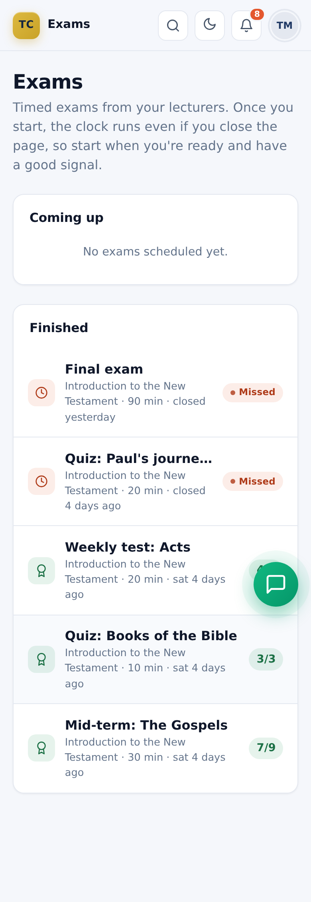

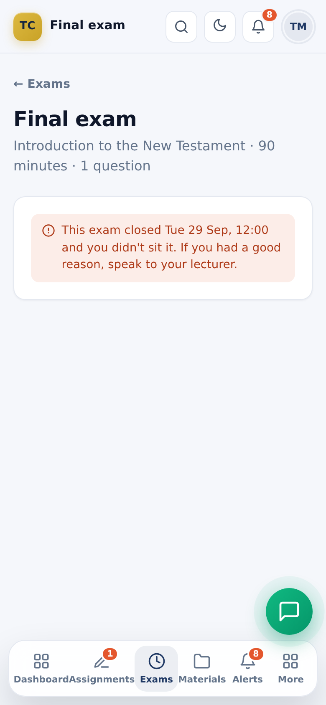

During the exam:

- The menus are hidden. Stay on the exam page: leaving it (for WhatsApp, another app or a website) is recorded and shown to your lecturer.
- Pasting text is blocked and recorded.
- If you lose signal, keep answering. Your answers are kept on the phone and sent when the signal returns.
- You can only write on one device. If your phone dies, ask your lecturer to press **New device**, then log in on another phone and tap **Continue the exam**.

### See your exam result

1. You get an alert when your lecturer releases the results.
2. Open **Exams** and tap the exam under **Finished**.
3. You see your mark, the lecturer's feedback, and each question with your answer and the correct answer.

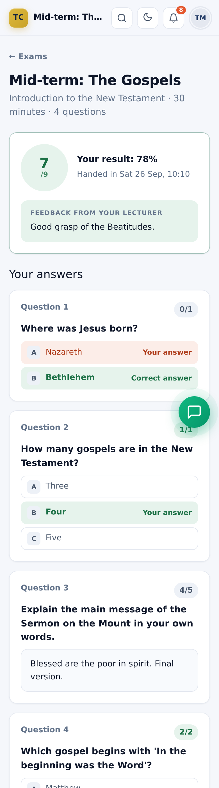

## 4. Results, Ezra and your profile

### See your course results

Your overall result for a course combines your assignments and exams. Your lecturer publishes it when all your work is marked.

1. You get an alert when a result is published.
2. Tap **More**, then **Results**.
3. Each course shows your final percentage, your grade (Distinction, Merit, Pass or Fail), the assignment and exam percentages, and any remarks from your lecturer.
4. Tap **Marks this is based on** to see every assignment and exam that counted.

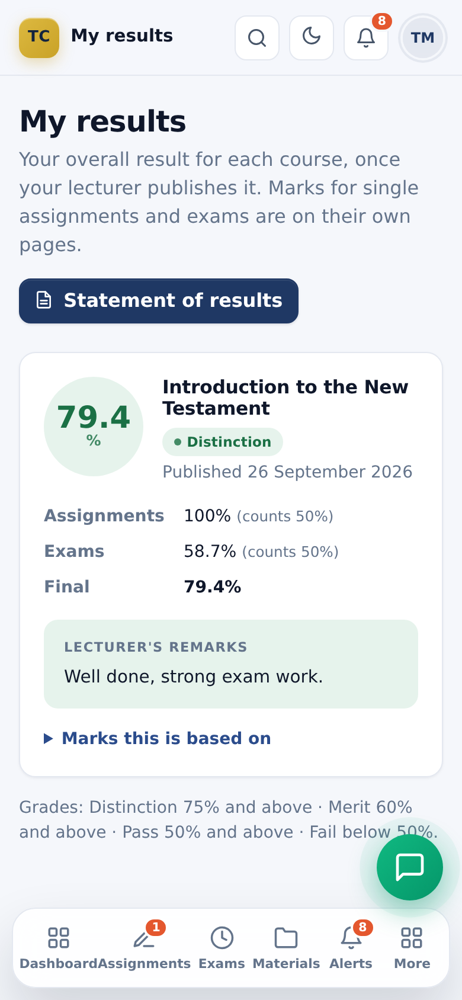

### Print your statement of results

1. On the **Results** page, tap **Statement of results**.
2. Tap **Print / Save as PDF**, then print it or save it as a PDF.

The statement has a QR code. Anyone who scans it (an employer, your church) sees the results the Center has published, so they know the paper is genuine.

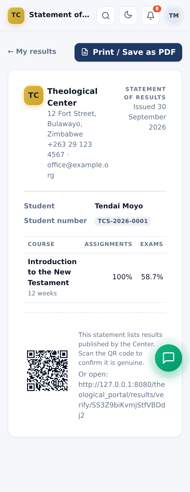

### Ask Ezra, your study companion

Ezra is a chat helper that lives in the **green chat button** at the bottom right of every page (on a phone it sits just above the bottom bar). It explains how to do things in the portal in simple steps, helps you understand a Bible passage, and answers in English, Shona or Ndebele: write in the language you prefer and Ezra replies in the same language.

1. Tap the green chat button. The Ezra window slides up.
2. Tap a quick button: **Exams**, **Upload ID** or **Romans 8**. Or type your own question, for example "How do I pay?" or "Explain Romans 8 simply", and tap the green arrow.
3. Wait a moment while the three dots show that Ezra is typing, then read the answer.
4. Tap the **X** (or the green button again) to close the window. Your conversation is still there when you open it again, even on another page.
5. To start a fresh conversation, tap the **pencil** icon at the top of the window.

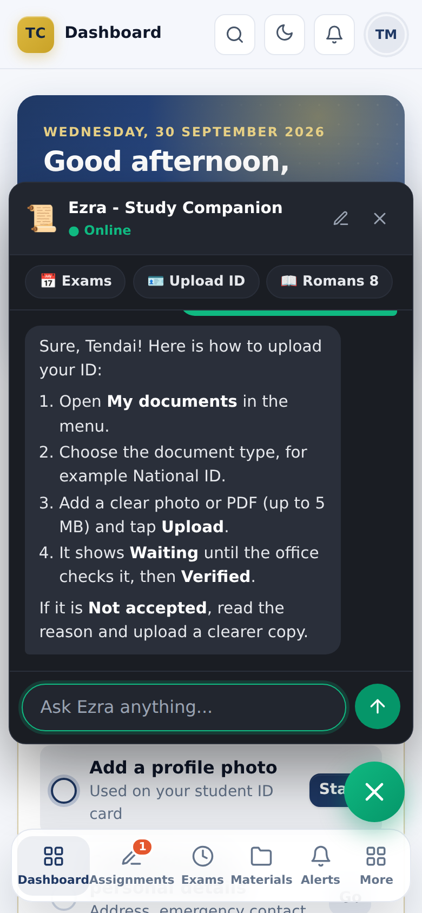

Good to know:

- Ezra gives **steps for students**. Ask "How do I upload proof of payment?" and you get the student steps.
- Ezra helps you learn. It **won't write your assignments** or answer exam questions for you, but it will explain ideas and help you plan your answer.
- Ezra can make mistakes. Check important things with your lecturer and your Bible.
- Ezra is **switched off while you are writing an exam**. It is back when you hand in.
- Ezra can't change anything in the portal. For payments, marks or passwords, contact the office.
- Your conversation is kept on your own phone or computer only. Clearing your browser data removes it.
- Some days Ezra may answer only from its built-in guides ("how do I..." questions) and say it can't answer other things right now. Try again later or ask your lecturer.

### Your profile, photo and ID card

1. Tap your initials (top right), then **My profile**.
2. **Profile photo**: tap it to take a photo or choose one, then **Save photo**. It appears on your ID card.
3. **About you**: fill in your address, emergency contact and church details, then save.
4. **Account details**: change your name, email or WhatsApp number, then **Save details**.
5. **Change password**: type your current password, then the new one twice, then **Update password**.
6. **My ID card**: tap the card to flip it. The back has a QR code that proves you are a student. Tap **Print** to print it.
7. **Appearance**: choose Light, Dark or Auto.

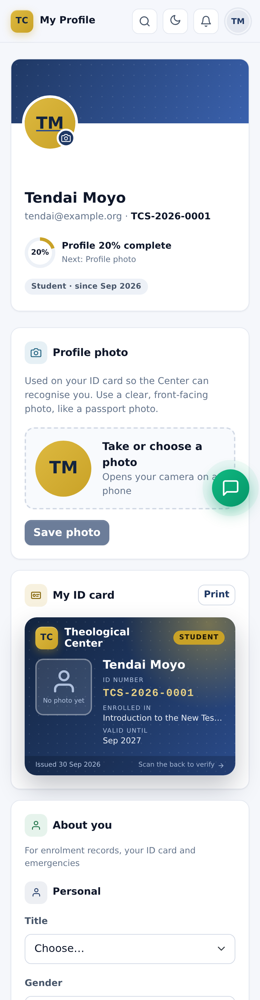

## 5. Calendar, discussions, library and attendance

These four pages are in the **Campus** part of the menu (on a phone: tap **More**). Attendance is in the main menu.

### See what's on: the Calendar

The calendar shows your classes, college events and holidays, plus your assignment due dates and exam times (added automatically).

1. Tap **More**, then **Calendar**.
2. The month shows coloured dots on busy days. Tap a day, or scroll down to the day-by-day list.
3. Tap an assignment or exam in the list to open it. Online classes have a **Join online** button.
4. Use the arrows to see the previous or next month.

You get an alert when your lecturer adds a class or moves its time. The dashboard's **Coming up** card shows the next two weeks.

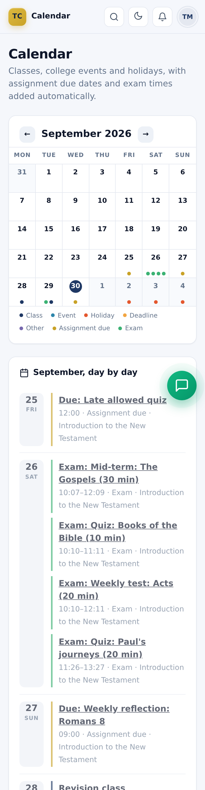

### Ask and answer: Discussions

Each of your courses has its own board, and **General** is for the whole college.

1. Tap **More**, then **Discussions**.
2. Tap a board at the top (**All**, **General** or a course), or search for a topic.
3. Tap a topic to read it, type in **Your reply**, and tap **Reply**.
4. To ask something new, tap **New topic**, choose the board, write a title and your message, and tap **Post topic**.

You get an alert when someone replies to your topic. Lecturers' posts carry a **Lecturer** tag. Be kind and respectful; lecturers can close or remove posts.

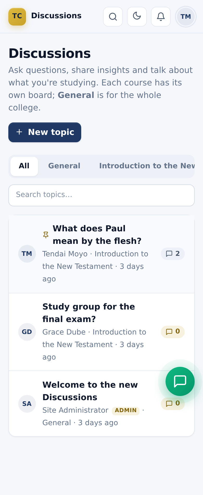

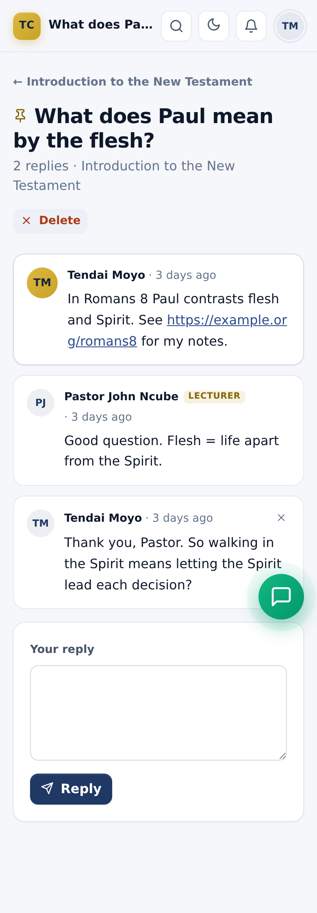

### Read and listen: the Library

The library holds books, commentaries, articles, sermons and recordings for every student. (Your course notes stay under **Materials**.)

1. Tap **More**, then **Library**.
2. Tap a category (Books, Sermons...), choose a course, or search by title or author.
3. Tap **Open** to read or download a file, or **Open link** for an online item.

Tip: Ezra knows how the library works. Ask "How do I find a book in the library?" for the steps.

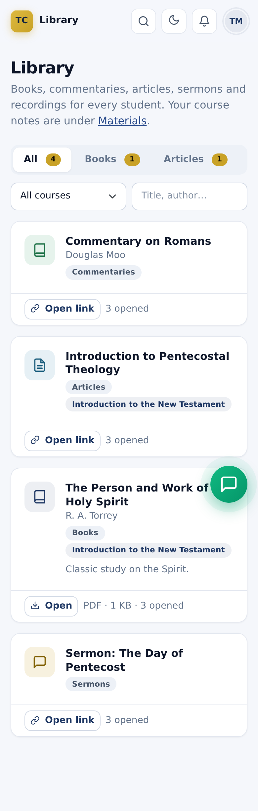

### Check your attendance

1. Tap **More**, then **Attendance**.
2. Each course shows your attendance rate and every class: **Present**, **Late**, **Absent** or **Excused**.

Your rate counts present and late as attended. Excused absences don't count against you. If a mark looks wrong, speak to your lecturer.

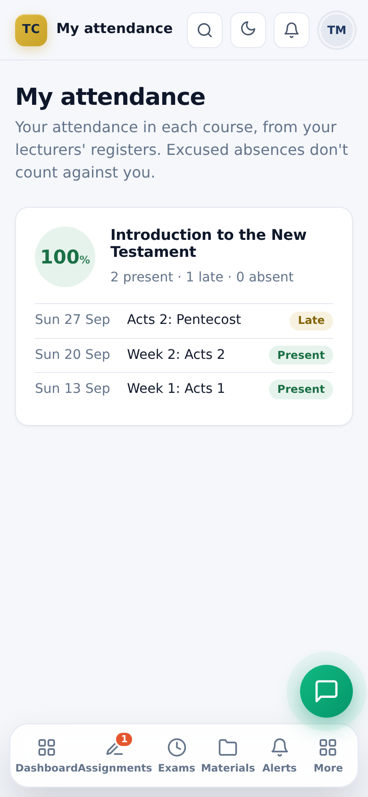

## 6. My documents (ID and qualifications)

The Center asks for a copy of your **National ID** (and sometimes other documents) to confirm who you are. Only you and the office can open them.

1. Tap **More**, then **My documents**. A red number on the menu means something is still needed.
2. **What the Center needs** shows each required document: **Verified**, **Waiting for the office**, **Not accepted** or **Not uploaded yet**.
3. Under **Upload a document**, choose what it is (for example **National ID**), add a description if you like, and choose the file. On a phone you can take a photo.
4. Make sure every word is readable and nothing is cut off, then tap **Send to the office**.
5. You get an alert when the office verifies it. If it isn't accepted, the reason is shown: upload a new copy.

You can remove a document until it is verified. Files can be PDF, JPG or PNG, up to 5 MB.

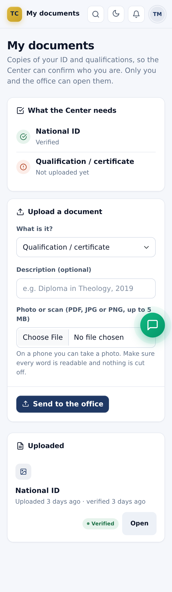

## 7. Getting help

### Contact the office

1. Tap **More**, then **Help & contact**.
2. Tap **Chat on WhatsApp**, call, or email the office. The page also shows office hours, the address, payment details, common questions and the privacy notice.

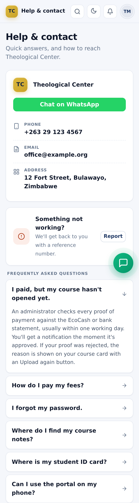

### Report a problem with the portal

1. On the page where something went wrong, open **More** and search for **Report a problem**.
2. Describe what happened, for example "The Download button does nothing".
3. Tap **Report**. You get a reference number (for example `ER-4F2A9C`). Quote it if you contact the office.

### Common problems

| Problem | What to do |
| --- | --- |
| I forgot my password | Tap **Forgot password?** on the login page. The office sends a new one on WhatsApp. |
| "Account locked" | Too many wrong passwords. Wait 15 minutes and try again. |
| My course is still "Awaiting payment" | Check **Payments**. If your proof is rejected, read the reason and upload again. Approval can take a working day. |
| I can't see the materials | The course opens only after your payment is approved. |
| I can't hand in my assignment | After the due date, late work is only accepted if your lecturer allows it. Speak to your lecturer. |
| My phone died during an exam | Ask your lecturer to press **New device**, then log in on another phone and tap **Continue the exam**. The timer keeps running. |
| Ezra says it is paused | You have an exam in progress. It is back when you hand in. |
| I can't see the Ezra button | Press Ctrl + F5 (or close and reopen the browser). The button shows on every page except the login page and while you write an exam. |
| Ezra says it can't answer that right now | Its AI helper is not running at the moment. It can still explain how to do things in the portal; for anything else, ask your lecturer. |
